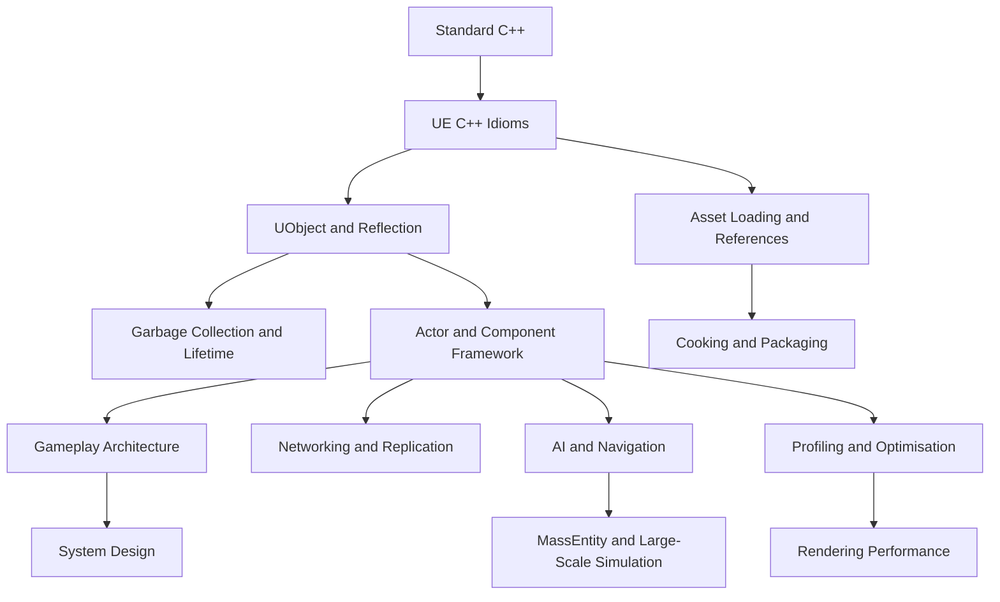
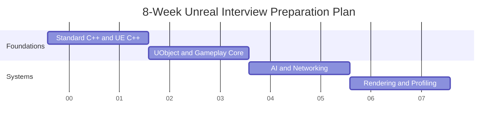

# Research Specification for a Comprehensive Unreal Engine Interview Learning Graph

## Executive Summary

Create a single, end-to-end research programme that an automated crawler can execute in order to build a structured learning plan and knowledge graph for a **~3-year Unreal Engine engineer preparing for interviews**. The crawler must **scrape, compare, deduplicate, rank, and synthesise** material across Unreal Engine, standard C++, UE C++ idioms, gameplay and engine architecture, AI, networking, rendering, profiling, tools, scripting integration, and interview preparation. The output must be a **single coherent curriculum**, not a loose set of links.

This specification is for **research planning only**. It is **not** the research itself. Do **not** summarise source content inside this file. Do **not** reduce scope. Preserve all previously discussed areas and add explicit coverage for **Lua** and **C#** integration in Unreal-adjacent workflows.

The crawler must prioritise **official Epic documentation**, **engine source where accessible**, and **recent UE5.3–UE5.6 materials**. It must mark **UE4-only**, **deprecated**, **experimental**, and **plugin-dependent** guidance. Final outputs must include both **human-readable Markdown** and a **machine-readable JSON knowledge graph**, along with a concise **README** explaining how sources were scraped, filtered, deduplicated, and ranked.

## Codex Checklist

Follow this checklist exactly.

- Read this entire specification before crawling.
- Preserve the full scope: UE core systems, UE5 specifics, C++, UE C++ idioms, gameplay patterns, system design, algorithms, math, profiling, tools, MassEntity/ECS, GAS, AI, rendering, networking, build/editor/tooling, Lua, C#, and interview artefacts.
- Use **en-GB** for all output.
- Focus on **UE5.3–UE5.6**, while explicitly marking older or deprecated material.
- Prioritise **official** and **primary** sources first.
- Crawl, compare, deduplicate, and rank sources before synthesis.
- Flag conflicting guidance and resolve it using the source-priority rules in this specification.
- Build both a **human-readable learning plan** and a **machine-readable JSON knowledge graph**.
- Produce all required deliverables with the exact filenames listed below.
- Include mermaid diagrams where requested.
- Include study schedules, project specifications, question banks, flashcards, and gap analysis.
- Label every sourced claim in the final deliverables using the citation format defined here.
- Keep outputs structured, navigable, and interview-oriented.
- Do not omit Lua or C# integration topics.
- Write a concise `README.md` describing how scraping, filtering, deduplication, and ranking were handled.

## Assumptions

| Item | Assumption |
|---|---|
| Target persona | A candidate preparing for interviews for a **~3-year Unreal Engine engineer** role |
| Language | **English (en-GB)** |
| Engine focus | **Unreal Engine 5**, with strong preference for **UE5.3–UE5.6** |
| Role breadth | Broad/generalist coverage with role overlays for gameplay, AI, rendering, networking, tools, engine, and technical design |
| Scope of knowledge | Unreal Engine plus adjacent interview knowledge: standard C++, UE C++ idioms, game programming patterns, algorithms, math, system design, profiling, build/tooling, Lua, and C# |
| Research mode | Codex will perform web crawling and source collection **after** receiving this specification |
| Current step | This document is **only** the specification file; it does not itself perform research |

## Constraints

| Constraint | Requirement |
|---|---|
| Current output | Produce **only** the specification content for `research.md` |
| No research now | Do **not** scrape, browse, summarise, or collect source content in this step |
| Scope preservation | Do **not** remove or narrow any previously discussed scope |
| Output format | Single Markdown file, suitable for direct copy-paste into Codex |
| Source handling in final research | Codex must deduplicate, prioritise, and flag conflicts |
| Version handling | Codex must emphasise **UE5.3–UE5.6** and clearly label UE4-only/deprecated material |
| Deliverables | Final research outputs must include both Markdown and JSON artefacts |
| Citation discipline | All final research deliverables must use the citation/source-label rules below |

## Mission

You are producing a **comprehensive research package** that will allow the user to study for wide, modern Unreal Engine interviews without drowning in disconnected material. The final research should answer:

- What topics exist?
- Which topics matter most for a ~3-year engineer?
- How deep should each topic be studied?
- How do the topics depend on one another?
- What are the best sources for each topic?
- What interview questions are realistic?
- What hands-on projects prove understanding?
- What common traps and outdated advice should be avoided?

## Final Deliverables

Produce all of the following files.

| Filename | Format | Purpose |
|---|---|---|
| `README.md` | Markdown | Concise explanation of how sources were scraped, filtered, deduplicated, ranked, and conflict-resolved |
| `ue_interview_learning_plan.md` | Markdown | Main human-readable curriculum and learning roadmap |
| `ue_interview_knowledge_graph.md` | Markdown | Human-readable topic graph with dependencies and topic pages |
| `ue_interview_knowledge_graph.json` | JSON | Machine-readable knowledge graph |
| `ue_topic_source_index.md` | Markdown | Topic-by-topic source index with ratings and labels |
| `ue_topic_source_index.json` | JSON | Machine-readable source index |
| `ue_interview_question_bank.md` | Markdown | Categorised interview questions with strong answers and follow-ups |
| `cpp_interview_question_bank.md` | Markdown | Standard C++ and UE C++ interview bank |
| `game_patterns_question_bank.md` | Markdown | Game programming patterns and architecture interview bank |
| `game_system_design_questions.md` | Markdown | System design prompts with structured answer frameworks |
| `ue_hands_on_projects.md` | Markdown | Practical project specifications |
| `ue_study_schedule.md` | Markdown | 4-week, 8-week, and 12-week study plans |
| `ue_flashcards.md` | Markdown | Anki-style flashcards |
| `ue_gap_analysis.md` | Markdown | Comparison of docs, blogs, job ads, interview anecdotes, and production reality |
| `cpp_for_unreal_interviews.md` | Markdown | Standard C++ concepts relevant to Unreal/game interviews |
| `ue_cpp_idioms.md` | Markdown | UE-specific C++ idioms, conventions, and anti-patterns |
| `game_programming_patterns.md` | Markdown | Patterns as used in games and in Unreal |
| `game_architecture_patterns.md` | Markdown | Runtime, gameplay, and content architecture patterns |
| `game_algorithms_and_data_structures.md` | Markdown | Algorithms and data structures for game and UE interviews |
| `game_math_for_interviews.md` | Markdown | Practical maths topics for gameplay, AI, rendering, and physics interviews |
| `scripting_integration_lua_csharp.md` | Markdown | Lua and C# integration topics, trade-offs, and interview relevance |
| `source_manifest.json` | JSON | Crawl manifest including scraped URLs, timestamps, deduplication groups, and ranking metadata |

## Output Bundle Rules

The final output set must include:

- At least one **primary learning document** that a human can read start-to-finish.
- At least one **machine-readable graph** that a script can consume.
- At least one **source manifest** that explains what was scraped and how it was filtered.
- At least one **README** that explains the crawler’s methodology in concise prose.

## Source Priority Rules

When sources disagree, rank them using this precedence order unless a lower-ranked source is materially newer and explicitly supersedes earlier guidance.

| Rank | Source Class | Notes |
|---|---|---|
| S1 | Official Epic documentation | Highest priority for UE behaviour and current systems |
| S2 | Unreal Engine source code, official API docs, official sample projects | Treat engine source as primary evidence where accessible |
| S3 | Epic talks, Unreal Fest sessions, official livestreams, official blog posts | Particularly valuable for architecture and recent changes |
| S4 | Official docs for non-UE languages/platforms | ISO C++ references, cppreference, Microsoft C# docs, Lua manual |
| S5 | Reputable studio engineering blogs and postmortems | Valuable for production patterns and pitfalls |
| S6 | High-quality books and talks | Game Programming Patterns, GDC talks, CppCon talks, etc. |
| S7 | Community tutorials, plugins, GitHub repos | Useful, but verify carefully and label plugin/version risk |
| S8 | Forum threads, Q&A, anecdotal interview posts | Use only as supplementary evidence and clearly label them |

## Source Preference Notes

Prefer:

- Recent materials covering **UE5.3–UE5.6**
- Sources with concrete code, profiling traces, diagrams, or implementation detail
- Official or primary-source explanations of **MassEntity**, **StateTree**, **Iris**, **RDG**, **Nanite**, **Lumen**, **GAS**, **Enhanced Input**, **World Partition**, **CommonUI**, **Motion Matching**, **MetaSounds**, **Lua plugins**, and **C# integration ecosystems**

Treat with caution:

- UE4-only advice
- Hot Reload advice that predates current Live Coding workflows
- Blog posts that confuse `TSharedPtr` with UObject ownership
- Community articles that present plugin-specific scripting behaviour as core Unreal behaviour
- Old networking guidance that predates Iris or newer replication details
- Old rendering guidance that predates RDG, Nanite, or Lumen

## Version Awareness Rules

Every topic and every source entry must be labelled with version scope.

| Label | Meaning |
|---|---|
| `Stable UE4/UE5` | Applies broadly to UE4 and UE5 |
| `Changed in UE5` | Works differently in UE5 |
| `UE5-specific` | New or meaningfully reworked in UE5 |
| `UE5.3–UE5.6 preferred` | Most relevant current target range |
| `Deprecated` | No longer recommended |
| `UE4-only` | Historical only |
| `Experimental` | Not stable by default |
| `Plugin-dependent` | Not part of baseline engine; depends on plugin/ecosystem |

Each topic page and source entry must also capture:

- Earliest relevant engine version
- Latest confirmed version
- Whether examples are still buildable or conceptually valid
- Whether guidance is editor-only, runtime, project-specific, or plugin-specific

## Evidence Requirements Per Topic

Each major topic must include a minimum evidence pack.

| Evidence Type | Minimum Requirement |
|---|---|
| Official reference | At least 1 official/primary source |
| Practical reference | At least 1 implementation-oriented source |
| Pitfall/debugging reference | At least 1 source focused on debugging, profiling, or common failure modes |
| Interview relevance | At least 1 interview-style question source or inferred interview rationale |
| Version note | Clear statement of applicability to UE5.3–UE5.6 |
| Conflict note | Present if any meaningful disagreement exists across sources |

Do not treat a topic as “covered” unless it has enough evidence to support:

- definition
- purpose
- how it works
- typical usage
- common mistakes
- debugging or profiling workflow
- interview relevance
- version applicability

## Topic Priority Scale

Use this exact mapping.

| Priority | Meaning | Expectation |
|---|---|---|
| `P0` | Absolutely essential | Very likely to be asked in broad UE interviews |
| `P1` | Very common | Strong working knowledge expected |
| `P2` | Common probing topic | Medium depth expected; often used for follow-up questions |
| `P3` | Specialist or role-dependent | Important for selected roles or deeper interviews |
| `P4` | Advanced/nice-to-have | Valuable differentiation but not baseline |

## Topic Depth Scale

Use this exact mapping.

| Depth | Meaning | What the learner must be able to do |
|---|---|---|
| `D1` | Recognition | Define it and explain why it exists |
| `D2` | Working knowledge | Use it correctly in normal project work |
| `D3` | Debugging knowledge | Diagnose common bugs, misuses, and performance problems |
| `D4` | Architectural knowledge | Design systems with it and explain trade-offs |
| `D5` | Internal/implementation knowledge | Understand internals, source-level behaviour, or advanced extensibility |

## Required Priority Mapping Table in Final Research

Codex must include a table mapping categories to default priority and depth expectations for a ~3-year engineer.

| Category | Default Priority Range | Default Depth Range | Notes |
|---|---|---|---|
| Core UE object system | P0–P1 | D3–D4 | Foundational |
| Gameplay framework | P0–P1 | D3–D4 | Foundational |
| Standard C++ | P0–P1 | D3–D4 | Foundational |
| UE C++ idioms | P0–P1 | D3–D4 | Foundational |
| Game patterns and architecture | P0–P2 | D2–D4 | Interview-heavy |
| Networking | P0–P2 | D2–D4 | High-value |
| AI and navigation | P1–P3 | D2–D4 | Common in gameplay roles |
| Rendering and profiling | P1–P3 | D2–D4 | Broad awareness required |
| Build/tools/editor | P1–P3 | D2–D3 | Common probing area |
| MassEntity/ECS | P2–P3 | D1–D3 | Increasingly relevant |
| GAS | P2–P3 | D1–D3 | Heavily project-dependent |
| Lua/C# integration | P3–P4 | D1–D3 | Plugin/project-dependent but worth awareness |

## Knowledge Graph Requirements

Build a directed dependency graph that makes prerequisites explicit. The graph must support both human learning order and machine analysis.

### Required Graph Characteristics

- Nodes grouped by category
- Directed prerequisite edges
- “Related topics” edges for lateral exploration
- Priority and depth stored per node
- Role relevance stored per node
- Version notes stored per node
- Common bugs and debugging workflows stored per node
- Ties to hands-on projects and interview questions stored per node

### Required Mermaid Graphs

The final human-readable output must include at least:

- one **global dependency graph**
- one **UE subsystem dependency graph**
- one **study timeline graphic**
- one **role overlay graphic**

### Example Mermaid Dependency Graph



## Knowledge Graph Node Schema

Use the following JSON schema shape for each node in `ue_interview_knowledge_graph.json`.

```json
{
  "id": "uobject_garbage_collection",
  "name": "UObject Garbage Collection",
  "category": "memory_lifetime",
  "priority": "P0",
  "expected_depth": "D4",
  "summary": "How Unreal tracks UObject references and reclaims unreachable objects.",
  "why_it_matters": "Foundational for safe UE C++ and common interview questions.",
  "prerequisites": ["uobject", "reflection", "uproperty"],
  "related_topics": ["tobjectptr", "tweakobjectptr", "actor_lifetime", "soft_references"],
  "role_relevance": {
    "gameplay": "high",
    "rendering": "medium",
    "tools": "high",
    "technical_artist": "low",
    "ai": "medium",
    "networking": "medium",
    "engine_generalist": "high"
  },
  "version_notes": {
    "label": "Stable UE4/UE5",
    "details": "Core concept remains stable; pointer idioms changed with UE5 TObjectPtr adoption."
  },
  "common_bugs": [
    "Raw UObject member pointer not tracked by reflection",
    "Async use-after-destroy",
    "Incorrect ownership assumptions with TSharedPtr"
  ],
  "debugging_tools": [
    "IsValid checks",
    "Reference chain viewer if available",
    "Logs and assertions",
    "Unreal Insights where lifetime spikes matter"
  ],
  "hands_on_tasks": [
    "Build a good vs bad UObject reference example",
    "Demonstrate weak vs soft vs strong ownership choices"
  ],
  "interview_questions": [
    "Why should UObject references usually be UPROPERTY or TObjectPtr?",
    "Why is TSharedPtr usually not used for UObject ownership?"
  ],
  "official_sources": [],
  "practical_sources": [],
  "source_conflicts": [],
  "content_flags": ["UE5.3–UE5.6 preferred"],
  "assessment": {
    "recognition": true,
    "working_knowledge": true,
    "debugging": true,
    "architecture": true,
    "implementation": false
  }
}
```

## Interview Question Entry Template

Use this exact structure for every interview question entry.

```markdown
### Question: Why should UObject references usually be UPROPERTY or TObjectPtr?

- **Category:** UObject / Memory / UE C++
- **Priority:** P0
- **Expected Depth:** D3
- **Short Answer:** Unreal’s reflection-aware systems need to see object references for GC, serialisation, editor exposure, and other engine features.
- **Strong 3-Year-Engineer Answer:** [2–5 paragraph answer]
- **Common Weak Answer:** “Because the editor needs it.”
- **Follow-up Questions:** 
  - What if I only want a weak reference?
  - When would TSoftObjectPtr be better?
  - Why is TSharedPtr different?
- **Hands-on Verification Task:** Create three member references and demonstrate which survive GC and which do not.
- **Sources:** [SRC-UE-001], [SRC-CPP-014]
- **Version Notes:** Stable UE4/UE5; mention UE5 TObjectPtr preference where relevant.
```

## Citation and Source Label Rules

Every source collected by Codex must receive a unique source ID. Every claim in the final human-readable synthesis must reference one or more source IDs.

### Source ID Format

Use:

```text
SRC-[DOMAIN FAMILY]-[NNN]
```

Examples:

- `SRC-EPIC-001`
- `SRC-API-014`
- `SRC-CPP-007`
- `SRC-MS-003`
- `SRC-LUA-002`
- `SRC-GDC-011`
- `SRC-BLOG-026`
- `SRC-FORUM-004`

### Required Source Entry Format

Each source entry in the source index must include:

| Field | Requirement |
|---|---|
| `source_id` | Unique label |
| `title` | Source title |
| `url` | Canonical URL |
| `source_class` | S1–S8 class |
| `topic_tags` | Relevant topic IDs |
| `publication_date` | If known |
| `accessed_date` | Date scraped |
| `engine_version_scope` | Version applicability |
| `language_scope` | UE, C++, Lua, C#, game patterns, etc. |
| `quality_score` | Numeric or categorical ranking |
| `dedupe_group` | Canonical cluster ID |
| `conflict_flags` | Empty or populated |
| `notes` | Brief relevance summary |

### Citation Rules in Final Research Outputs

- Cite factual claims inline or at paragraph end using source IDs.
- If multiple sources support the same point, list multiple source IDs.
- If guidance conflicts, cite all conflicting sources and add a conflict note.
- Mark anecdotal/interview-blog content as anecdotal rather than authoritative.
- When a claim depends on plugin-specific scripting technology, label it `Plugin-dependent`.

## Conflict Handling Rules

When guidance conflicts:

1. Prefer official docs and engine source.
2. Prefer newer UE5.3–UE5.6 material over older material.
3. Prefer sources with code, profiling traces, or concrete implementation detail.
4. If conflict remains unresolved, keep both positions and label uncertainty.
5. If a plugin or ecosystem feature is being discussed, make clear that it is **not baseline Unreal**.

Every final topic page must include a `Conflict Notes` subsection if conflicts exist.

## Output Style and Formatting Rules

All final deliverables must follow these formatting rules.

- Use **en-GB** spelling and phrasing.
- Use Markdown headings consistently.
- Use tables for deliverables, schedules, mappings, and comparisons.
- Use mermaid diagrams where useful for dependencies and timelines.
- Keep paragraphs clear and information-dense.
- Prefer explicit labels and structured fields over vague prose.
- Use consistent terminology across files.
- Do not bury version notes or plugin caveats in footnotes.
- Use short code examples only where they clarify concepts.
- Avoid long verbatim quoting from sources.

## Required Human-Readable Document Structure

The main learning plan should include, at minimum:

```text
Executive Summary
How to Use This Research Package
Learner Profile and Interview Assumptions
Priority and Depth System
Knowledge Graph Overview
Core Learning Tracks
Role Overlays
Hands-On Projects
Study Schedules
Question Bank Overview
Gap Analysis Summary
Top Must-Know Concepts
Source Index
```

## Topic Taxonomy

The final knowledge graph and documents must cover all categories below.

### Core Category IDs

| Category ID | Category Name |
|---|---|
| `standard_cpp` | Standard C++ |
| `ue_cpp_idioms` | Unreal-specific C++ idioms |
| `cpp_memory_model` | C++ memory, ownership, and layout |
| `cpp_templates` | Templates, generic programming, metaprogramming awareness |
| `cpp_concurrency` | Concurrency and async work |
| `cpp_performance` | Performance and data-oriented reasoning |
| `cpp_build_debug` | Build, linking, debugging, toolchain |
| `object_system` | UObject system and reflection |
| `memory_lifetime` | Unreal lifetime, GC, pointers |
| `gameplay_framework` | Actor/component/gameplay framework |
| `cpp_blueprint` | C++ and Blueprint integration |
| `gameplay_architecture` | Gameplay architecture and system design |
| `networking` | Replication, RPCs, multiplayer architecture |
| `ai_navigation` | AI, navigation, behaviour, StateTree |
| `ecs_mass` | ECS, MassEntity, large-scale simulation |
| `rendering` | Rendering, materials, shaders, frame pipeline |
| `profiling_optimisation` | Profiling, optimisation, performance workflow |
| `asset_pipeline` | Asset references, loading, cooking, packaging |
| `build_tools` | Modules, plugins, UBT, UHT, build config |
| `editor_tools` | Editor scripting, validation, pipeline tooling |
| `animation` | Animation systems and gameplay integration |
| `physics_collision` | Collision, traces, physics, Chaos |
| `ui` | UI, UMG, Slate, CommonUI |
| `audio_vfx` | Audio, MetaSounds, Niagara, effects workflow |
| `modern_ue5` | UE5-era systems and changes |
| `game_programming_patterns` | Game programming patterns |
| `game_architecture` | Runtime and content architecture |
| `game_algorithms` | Algorithms and data structures |
| `game_math` | Maths for gameplay, AI, physics, rendering |
| `game_realtime_systems` | Real-time systems and frame budgeting |
| `scripting_lua` | Lua integration and scripting patterns |
| `scripting_csharp` | C# integration and tooling/runtime patterns |
| `system_design` | Game/system design questions |
| `interview_practice` | Interview prep artefacts and meta-skills |

## Exhaustive Topic List by Category

Below is the minimum topic coverage to research. Codex may add missing subtopics if they are clearly relevant.

### Standard C++

`value_vs_reference`, `object_lifetime`, `stack_vs_heap`, `constructors_destructors`, `copy_move_semantics`, `rule_of_zero_three_five`, `raii`, `const_correctness`, `references_and_pointers`, `smart_pointers`, `lvalue_rvalue`, `std_move`, `std_forward`, `perfect_forwarding`, `temporary_lifetime`, `undefined_behaviour`, `alignment_padding`, `virtual_functions`, `inheritance_vs_composition`, `multiple_inheritance_awareness`, `abstract_interfaces`, `templates`, `template_specialisation`, `sfinae_awareness`, `concepts_awareness`, `constexpr`, `lambda_captures`, `operator_overloading_awareness`, `exceptions_policy`, `rtti_awareness`, `type_erasure_awareness`

### C++ Memory and Performance

`owning_vs_nonowning_pointers`, `unique_ptr`, `shared_ptr`, `weak_ptr`, `reference_cycles`, `allocator_awareness`, `memory_fragmentation`, `cache_locality`, `aos_vs_soa`, `false_sharing`, `iterator_invalidation`, `copy_elision`, `small_object_optimisation_awareness`, `hot_path_reasoning`, `allocation_cost`, `branch_prediction_awareness`, `virtual_dispatch_cost`, `frame_budgets`, `fixed_vs_variable_timestep`

### STL and Data Structures

`vector`, `array`, `deque`, `list_awareness`, `map`, `unordered_map`, `set`, `unordered_set`, `string`, `string_view`, `span`, `optional`, `variant`, `function`, `tuple`, `priority_queue`, `hashing_basics`, `ranges_awareness`

### C++ Concurrency and Tooling

`thread_basics`, `jthread_awareness`, `async_future_promise_awareness`, `mutex`, `shared_mutex_awareness`, `condition_variable`, `atomics`, `memory_order_awareness`, `race_conditions`, `deadlocks`, `lock_contention`, `thread_pools`, `job_systems`, `double_buffering`, `main_thread_affinity`, `linking`, `symbols`, `odr`, `forward_declarations`, `include_hygiene`, `unity_builds_awareness`, `pch_awareness`, `assertions`, `sanitisers_awareness`, `debugger_usage`

### UE C++ Idioms

`fstring_fname_ftext`, `tarray_tmap_tset`, `toptional_tvariant`, `tfunction_tfunctionref`, `cast_exactcast_isa`, `newobject`, `spawnaactor`, `spawnactor_deferred`, `createdefaultsubobject`, `loadobject`, `constructorhelpers`, `tsubclassof`, `tscriptinterface`, `delegates_native_dynamic`, `logging_and_checks`, `uobject_vs_cpp_object`, `outer`, `cdo`, `reflection_macros`, `tobjectptr`, `tweakobjectptr`, `tsoftobjectptr`, `tsoftclassptr`, `tstrongobjectptr`, `anti_patterns_ue_cpp`

### UObject System and Lifetime

`uobject`, `uclass`, `ustruct`, `uenum`, `ufunction`, `uproperty`, `generated_body`, `reflection`, `uht`, `serialisation`, `config_properties`, `savegame_properties`, `transient_properties`, `packages`, `object_flags_awareness`, `duplicateobject`, `findobject`, `soft_object_paths`, `garbage_collection`, `root_set`, `reference_graph`, `addtoroot`, `fgcobject_awareness`, `object_validity`

### Gameplay Framework

`aactor`, `uactorcomponent`, `uscenecomponent`, `uprimitivecomponent`, `apawn`, `acharacter`, `acontroller`, `aplayercontroller`, `aaicontroller`, `gamemode`, `gamestate`, `playerstate`, `gameinstance`, `world`, `level`, `subsystems`, `actor_lifecycle`, `component_lifecycle`, `constructor_vs_beginplay`, `tick`, `timers`, `deferred_spawning`, `ownership_and_attachment`

### C++ / Blueprint Integration

`blueprint_callable`, `blueprint_pure`, `blueprint_implementable_event`, `blueprint_native_event`, `blueprint_assignable`, `edit_specifiers`, `meta_specifiers`, `blueprint_function_libraries`, `blueprint_interfaces`, `dynamic_delegates`, `latent_actions_awareness`, `async_action_nodes_awareness`, `construction_script`, `data_only_blueprints`, `blueprint_vm_awareness`, `blueprint_debugging`, `blueprint_performance`

### Gameplay Architecture and System Design

`actor_component_composition`, `interfaces`, `delegates`, `event_driven_design`, `gameplay_tags`, `message_subsystem`, `dataassets`, `primarydataassets`, `datatables`, `curvetables`, `asset_manager`, `inventory_systems`, `interaction_systems`, `health_damage_systems`, `abilities_without_gas`, `save_systems`, `quest_systems`, `equipment_systems`, `state_machines`, `subsystem_architecture`, `dependency_management`, `hard_vs_soft_references`, `circular_dependency_risk`

### Networking and Replication

`server_authority`, `client_server_model`, `listen_vs_dedicated`, `breplicates`, `relevancy`, `net_update_frequency`, `replicated_properties`, `onrep`, `dolifetime`, `replication_conditions`, `rpc_server_client_multicast`, `reliable_vs_unreliable`, `ownership`, `authority_checks`, `autonomous_vs_simulated_proxy`, `dormancy`, `movement_replication`, `character_movement_prediction`, `client_prediction_reconciliation`, `replication_graph_awareness`, `iris_awareness`, `subobject_replication`, `component_replication`, `fast_array_serializer`, `network_debugging`

### AI, Navigation, and Game AI

`aicontroller`, `behavior_tree`, `blackboard`, `tasks_services_decorators`, `observer_aborts`, `move_to`, `path_following`, `eqs`, `ai_perception`, `sense_sight_hearing_damage`, `stimuli_sources`, `navigation_system`, `recast_navmesh`, `navmesh_bounds_volume`, `nav_agent_settings`, `nav_modifiers`, `nav_link_proxy`, `dynamic_navmesh`, `navigation_invokers`, `rvo_avoidance`, `detour_crowd`, `state_tree`, `smart_objects`, `gameplay_tasks_awareness`, `ai_debugger`, `visual_logger`, `fsm`, `hfsm`, `utility_ai_awareness`, `goap_awareness`, `htn_awareness`, `pathfinding_algorithms`

### ECS and MassEntity

`ecs_concepts`, `entity_component_systems`, `data_oriented_design`, `archetypes`, `chunks`, `massentity`, `mass_fragments`, `mass_tags`, `mass_shared_fragments`, `mass_chunk_fragments`, `mass_processors`, `mass_queries`, `mass_entity_manager`, `mass_observers`, `mass_traits`, `mass_spawners`, `mass_representation`, `mass_lod`, `mass_replication_awareness`, `mass_ai_awareness`, `hybrid_actor_mass_patterns`, `mass_debugging`

### GAS and Modern UE5 Systems

`gas_basics`, `ability_system_component`, `gameplay_ability`, `gameplay_effect`, `attributes`, `attribute_set`, `gameplay_cues`, `prediction_in_gas_awareness`, `enhanced_input`, `commonui_awareness`, `world_partition`, `data_layers`, `pcg_awareness`, `motion_matching_awareness`, `pose_search_awareness`, `control_rig_awareness`, `metasounds_awareness`, `virtual_shadow_maps`, `nanite`, `lumen`, `rdg_awareness`

### Rendering and Graphics Performance

`game_render_rhi_gpu_threads`, `frame_pipeline`, `deferred_vs_forward`, `gbuffer_awareness`, `depth_prepass`, `base_pass`, `shadow_pass`, `lighting_pass`, `translucency_pass`, `post_process`, `render_targets`, `scene_capture`, `materials`, `material_instances`, `dynamic_material_instances`, `shader_compilation`, `shader_permutations`, `shader_complexity`, `overdraw`, `masked_vs_translucent`, `wpo_cost`, `draw_calls`, `mesh_draw_commands_awareness`, `instancing`, `ism_hism`, `lod_hlod`, `frustum_culling`, `occlusion_culling`, `texture_streaming`, `mipmaps`, `virtual_textures_awareness`, `renderdoc_awareness`, `gpu_visualiser`

### Profiling and Optimisation

`stat_unit`, `stat_game`, `stat_gpu`, `stat_scenerendering`, `stat_rhi`, `stat_memory`, `stat_uobject`, `unreal_insights`, `timing_insights`, `memory_insights`, `networking_insights_awareness`, `asset_loading_insights`, `cpu_vs_gpu_bound`, `tick_optimisation`, `pooling`, `timers_vs_tick`, `async_tasks`, `parallelfor`, `task_graph`, `significance_manager_awareness`, `lod_strategies`, `scalability_settings`, `device_profiles`, `gc_pressure`, `allocation_patterns`, `too_many_actors`, `too_many_npcs`, `too_many_widgets`

### Asset Pipeline, Loading, Cooking, Packaging

`hard_references`, `soft_references`, `tsoftobjectptr`, `tsoftclassptr`, `fsoftobjectpath`, `asset_manager`, `primary_assets`, `primary_asset_labels`, `async_loading`, `streamable_manager`, `asset_registry`, `cooking`, `packaging`, `pak_iostore_awareness`, `ddc`, `redirectors`, `migration`, `editor_only_content`, `texture_streaming_memory`, `animation_compression_awareness`, `level_streaming`, `one_file_per_actor_awareness`

### Build System, Modules, Plugins, Editor Tools

`ubt`, `uht`, `build_cs`, `target_cs`, `uproject`, `uplugin`, `module_rules`, `public_private_dependencies`, `public_private_folders`, `runtime_module`, `editor_module`, `developer_module_awareness`, `third_party_modules_awareness`, `plugins`, `content_plugins`, `engine_vs_project_plugins`, `generated_headers`, `live_coding`, `hot_reload`, `intermediate_binaries_cleanup`, `packaging_errors`, `with_editor`, `editor_utility_widgets`, `editor_utility_blueprints`, `python_scripting_awareness`, `commandlets_awareness`, `asset_actions_awareness`, `details_customisation_awareness`, `custom_asset_types_awareness`, `asset_factories_awareness`, `data_validation`, `source_control_workflow`

### Animation, Physics, UI, Audio, VFX

`skeletal_mesh`, `skeleton`, `animation_sequence`, `animation_montage`, `anim_blueprint`, `state_machine_anim`, `blend_spaces`, `aim_offsets`, `root_motion`, `ik_awareness`, `linked_anim_layers_awareness`, `animation_notifies`, `sync_groups_awareness`, `character_movement_and_animation`, `chaos_physics`, `collision_channels`, `trace_channels`, `overlap_vs_hit`, `sweep`, `line_trace`, `sphere_trace`, `capsule_trace`, `physics_constraints_awareness`, `ragdoll_awareness`, `physical_materials_awareness`, `substepping_awareness`, `umg`, `uuserwidget`, `slate_awareness`, `commonui_awareness`, `ui_bindings_cost`, `event_driven_ui`, `world_space_widgets`, `niagara`, `gpu_particles_awareness`, `effect_pooling`, `sound_cues_awareness`, `metasounds_awareness`, `attenuation`, `concurrency_awareness`, `audio_components`

### Game Programming Patterns and Architecture

`game_loop`, `update_method`, `component_pattern`, `observer_pattern`, `command_pattern`, `state_pattern`, `strategy_pattern`, `factory_pattern`, `prototype_pattern`, `object_pool`, `flyweight`, `service_locator`, `event_queue`, `message_bus`, `data_driven_design`, `blackboard_pattern`, `behavior_tree_pattern`, `ecs_pattern`, `dirty_flag`, `double_buffer`, `spatial_partition`, `type_object`, `subclass_sandbox_awareness`, `runtime_architecture`, `content_architecture`, `editor_runtime_separation`, `resource_streaming_architecture`

### Algorithms and Data Structures

`sorting_basics`, `searching_basics`, `hashing`, `graph_traversal`, `bfs`, `dfs`, `dijkstra`, `astar`, `heuristics`, `weighted_astar_awareness`, `priority_queue`, `topological_sort_awareness`, `union_find_awareness`, `weighted_random`, `noise_awareness`, `interpolation`, `smoothing`, `grid`, `spatial_hash`, `quadtree`, `octree`, `bvh_awareness`, `kd_tree_awareness`, `broadphase_narrowphase`, `aabb`, `obb_awareness`, `sphere_bounds`, `frustum_culling_math`, `interest_management_awareness`, `snapshot_interpolation_awareness`, `lag_compensation_awareness`, `rollback_awareness`

### Game Maths

`vectors`, `dot_product`, `cross_product`, `normalisation`, `distance_vs_squared_distance`, `projection`, `reflection`, `angles_between_vectors`, `coordinate_spaces`, `basis_vectors`, `rotators`, `quaternions`, `gimbal_lock`, `matrices_awareness`, `transforms`, `local_vs_world_space`, `slerp`, `lerp`, `ray_intersections`, `sweep_math`, `normals`, `impulse_awareness`, `velocity_acceleration`, `gravity`, `friction_restitution_awareness`, `torque_awareness`, `view_projection_spaces`, `clip_ndc_screen_space_awareness`, `uv_coordinates`, `tangent_space_awareness`, `normal_maps_awareness`, `depth_buffer_awareness`, `linear_vs_gamma_awareness`

### Lua Integration

`lua_use_cases_in_games`, `lua_as_gameplay_scripting`, `lua_embedding_concepts`, `lua_bindings_awareness`, `ua_plugin_ecosystem_awareness`, `unlua_awareness`, `sluaunreal_awareness`, `puerts_lua_modes_awareness`, `lua_hotfix_patterns`, `lua_data_driven_workflows`, `lua_performance_tradeoffs`, `lua_gc_vs_ue_gc`, `lua_debugging_awareness`, `lua_interview_relevance`

### C# Integration

`csharp_use_cases_around_unreal`, `csharp_for_tools_pipeline`, `csharp_runtime_plugin_awareness`, `unrealclr_awareness`, `mono_based_historical_awareness`, `csharp_editor_automation_awareness`, `build_pipeline_tools_csharp`, `interop_boundaries`, `managed_vs_native_lifetime`, `gc_interop_awareness`, `csharp_job_role_relevance`, `csharp_interview_relevance`

### Interview Preparation Artefacts

`question_banks`, `flashcards`, `mock_interviews`, `portfolio_project_explanations`, `debugging_scenarios`, `performance_scenarios`, `system_design_prompts`, `role_specific_overlays`, `top_must_know_concepts`

## Required Research Questions Per Category

Each topic page must answer topic-specific questions, and each category must also answer the following minimum category-level questions.

### Standard C++

- What does a ~3-year UE engineer actually need to know versus what is specialist C++ depth?
- Which C++ concepts most often surface in UE interviews?
- Which C++ pitfalls cause real bugs in games and engines?
- How do standard C++ ownership models differ from Unreal’s ownership model?

### UE C++ Idioms

- What makes UE C++ different from standard C++?
- Which UE helper types and idioms are interview-critical?
- Which anti-patterns most clearly distinguish weak from strong UE experience?

### UObject and Lifetime

- Why does Unreal need reflection on top of C++?
- What does UHT do?
- What does `UPROPERTY` do besides editor exposure?
- How does GC discover references?
- When is a raw `UObject*` unsafe?
- Why is `TSharedPtr<UObject>` usually the wrong mental model?
- What is the CDO and why does it matter?
- What is `Outer` and what does it imply?

### Gameplay Framework

- Actor vs UObject?
- Actor vs Component?
- Pawn vs Character?
- Controller vs Pawn?
- GameMode vs GameState?
- PlayerController vs PlayerState?
- When should logic live in a subsystem rather than an Actor or Component?

### C++ / Blueprint

- What belongs in C++ vs Blueprint?
- How expensive is Blueprint in practice?
- When should dynamic delegates be used?
- When should interfaces be preferred over casts?
- Which Blueprint architecture mistakes show weak engineering judgement?

### Gameplay Architecture

- How would you design a health system?
- How would you design an inventory system?
- How would you design interactables?
- How would you make a system data-driven?
- How would you make the same system multiplayer-ready?
- How would you make it save/load friendly?

### Networking

- Why does an RPC fail to fire?
- Who is allowed to call a Server RPC?
- Why is GameMode server-only?
- What should be predicted?
- How do `OnRep` functions fit into architecture?
- When does Fast Array Serialiser matter?
- What is Iris and what depth is interview-relevant for a ~3-year engineer?

### AI and Navigation

- How do AIController and Pawn relate?
- Behaviour Tree vs Blackboard?
- Task vs Service vs Decorator?
- When to use EQS?
- Why does MoveTo fail?
- Pathfinding vs avoidance?
- Behaviour Tree vs StateTree vs FSM?
- When are Smart Objects useful?
- What are common AI performance bottlenecks?

### ECS and MassEntity

- Why use ECS at all?
- Actor OOP vs ECS?
- When should MassEntity be used?
- When should it not be used?
- What is a Fragment, Processor, Archetype, or Chunk?
- What level of Mass knowledge is expected for a broad ~3-year UE engineer?

### Rendering and Profiling

- Draw call cost vs shader cost?
- Game-thread bound vs render-thread bound vs GPU-bound?
- What makes materials expensive?
- What causes permutation explosion?
- What is RDG at interview depth?
- What does Nanite solve and not solve?
- What does Lumen solve and not solve?
- How do you profile GPU cost systematically?

### Asset Pipeline and Build Tools

- Why does something work in editor but fail in packaged build?
- Hard vs soft references?
- How does cooking interact with soft references?
- What do UBT and UHT each do?
- Public vs Private dependencies?
- Why can Live Coding or Hot Reload be unsafe?

### Animation, Physics, UI, Audio, VFX

- How should gameplay talk to animation?
- When use montage vs state machine?
- Why are UI bindings expensive?
- How do you avoid hard UI coupling?
- How do you replicate cosmetics sensibly?
- How do you debug collision and trace problems?

### Patterns and Architecture

- Component vs inheritance?
- Observer/delegates vs direct references?
- Service Locator risks?
- When is Object Pool good, and when is it harmful?
- How do data-driven patterns map into Unreal?
- How do gameplay systems stay modular under real production pressure?

### Algorithms and Maths

- Which algorithms are directly useful in games and UE?
- Which maths questions are common in interviews?
- Which spatial structures matter for AI, physics, and rendering?
- Which concepts are practical rather than academic?

### Lua and C#

- Where do Lua and C# fit in Unreal-adjacent workflows?
- Which plugins or ecosystems are common enough to be interview-relevant?
- How do managed or embedded runtimes interact with Unreal’s native/object lifetime models?
- What should a general UE interview candidate know even if the project does not use scripting languages heavily?

## Hands-On Project Requirements

Produce **10 hands-on project specifications**. Each project must include:

- goal
- topics covered
- required systems and minimal features
- implementation steps
- debugging exercises
- interview questions unlocked
- stretch goals
- role relevance

### Required Projects

| Project | Required Minimum Features |
|---|---|
| `Project 1: Core Gameplay Sandbox` | C++ Character, Blueprint child, Health Component, damage, interactable interface, DataAsset-driven item, UI health bar, SaveGame, delegates, soft references |
| `Project 2: AI Combat Sandbox` | AIController, Behaviour Tree, Blackboard, EQS, AI Perception, NavMesh movement, patrol/chase/attack states, AI Debugger, MoveTo failure debugging |
| `Project 3: Networked Mini Game` | server authority, replicated health, replicated score, Server RPC, Client RPC, NetMulticast, OnRep, ownership bug exercise, dormancy/relevancy discussion |
| `Project 4: Rendering and Optimisation Lab` | many meshes/materials, instancing, LOD, Nanite comparison, expensive material, translucency/overdraw test, `stat unit`, `stat gpu`, GPU Visualiser, Unreal Insights |
| `Project 5: MassEntity Crowd Prototype` | Mass entities, fragments, processors, traits, representation, LOD, Actor-vs-Mass comparison, Mass debugging |
| `Project 6: Tools and Plugin Project` | runtime module, editor module, plugin, Build.cs dependencies, Editor Utility Widget, asset validation, batch asset modification, packaging test |
| `Project 7: C++ Lifetime and Ownership Lab` | RAII examples, `unique_ptr/shared_ptr/weak_ptr`, move semantics, iterator invalidation, object pool example, cache-locality comparison, UObject pointer comparison |
| `Project 8: Game Patterns Sandbox` | Component, Observer/delegate, Command, State, Strategy, Object Pool, data-driven definitions, service-locator-via-subsystem discussion, event queue/message bus |
| `Project 9: System Design Portfolio` | inventory, health/damage, weapon, interaction, quest/objective, save/load, AI enemy, UI notifications, with architecture notes |
| `Project 10: Scripting Integration Lab` | one Lua integration path and one C# integration path researched and prototyped if feasible, with lifecycle boundaries, data flow, debugging notes, and plugin caveats clearly documented |

### Project Output Format

Use this structure for each project.

```markdown
## Project X: Name

**Goal:**  
**Target Roles:**  
**Topics Covered:**  
**Minimum Features:**  
**Implementation Steps:**  
**Key Unreal Systems:**  
**Debugging Exercises:**  
**Performance Checks:**  
**Interview Questions Unlocked:**  
**Stretch Goals:**  
**Version / Plugin Caveats:**  
```

## Interview Question Bank Requirements

Create multiple question-bank files, but ensure the total coverage below is met. Questions must be realistic and role-relevant, not trivia-only.

### Minimum Question Counts by Area

| Area | Minimum Count |
|---|---|
| Standard C++ | 100 |
| UE C++ idioms | 80 |
| UObject / reflection / GC / lifetime | 50 |
| Gameplay framework | 50 |
| C++ / Blueprint architecture | 50 |
| Gameplay architecture and system design | 80 |
| Networking and replication | 50 |
| AI and navigation | 50 |
| ECS and MassEntity | 40 |
| Rendering and graphics performance | 50 |
| Profiling and optimisation | 50 |
| Asset pipeline / build / tools | 40 |
| Animation / physics / UI / audio / VFX | 30 |
| Game programming patterns | 80 |
| Game algorithms and data structures | 50 |
| Game maths | 50 |
| Lua integration | 20 |
| C# integration | 20 |

### Required Question Format

Each entry must use the template defined earlier and include:

- category
- priority
- expected depth
- short answer
- strong ~3-year-engineer answer
- common weak answer
- follow-up questions
- hands-on verification task
- source IDs
- version notes

## Flashcard Requirements

Create a flashcard file with **at least 500 flashcards** total.

### Minimum Flashcard Counts by Area

| Area | Minimum Count |
|---|---|
| Standard C++ | 100 |
| UE core object system and UE C++ | 120 |
| Gameplay framework and architecture | 80 |
| Networking and AI | 70 |
| Rendering and profiling | 60 |
| Build/tools/assets | 40 |
| Patterns/system design | 40 |
| Algorithms and maths | 40 |
| Lua and C# integration | 20 |
| Interview meta and debugging workflows | 30 |

### Flashcard Format

```markdown
Q: What is the difference between GameMode and GameState?
A: GameMode contains server-only game rules, while GameState stores match state that is replicated to clients.
Category: Gameplay Framework
Priority: P0
```

## Study Schedule Requirements

Produce **three study plans** using tables and including mermaid timelines.

### Required Plans

| Plan | Use Case |
|---|---|
| `4-week crash plan` | Urgent interview preparation |
| `8-week serious plan` | Balanced preparation |
| `12-week deep plan` | Broader mastery and portfolio alignment |

### Required Structure Per Plan

Each plan must include:

- weekly goals
- daily or sub-weekly topic focus
- required reading categories
- hands-on tasks
- mock interview checkpoints
- “must finish”, “should finish”, and “optional deep dive” columns
- an explicit dependency-aware ordering

### Required Schedule Table Columns

| Week | Topics | Must Finish | Should Finish | Optional Deep Dive | Hands-On | Mock Interview Focus |

### Example Mermaid Timeline



## Gap Analysis Requirements

Create `ue_gap_analysis.md` comparing:

- official docs
- engine source
- official talks
- studio blogs
- job descriptions
- interview blogs
- practical project needs

### Required Gap Analysis Sections

- topics official docs cover well
- topics official docs explain poorly
- topics commonly asked in interviews but hard to learn from docs
- topics where blogs are outdated
- topics where UE4/UE5 differences confuse learners
- topics overrepresented in interviews relative to daily work
- topics underrepresented in docs relative to interview relevance
- plugin-dependent areas that are often presented as UE core
- misconceptions and red-flag advice

### Required “Similar But Different” Table

Include a table for commonly confused concepts, such as:

- Hot Reload vs Live Coding
- `TSharedPtr` vs UObject GC ownership
- GameMode vs GameState
- PlayerController vs PlayerState
- Behaviour Tree vs StateTree
- pathfinding vs avoidance
- draw calls vs shader complexity
- hard reference vs soft reference
- Actor crowd vs MassEntity crowd
- Blueprint event vs delegate
- Lua GC vs UE GC
- C# managed lifetime vs native lifetime

## README Requirements

Produce a concise `README.md` that explains:

- crawl scope
- how search queries were generated
- how source classes were prioritised
- how duplicates were clustered
- how conflicts were flagged
- how version tags were assigned
- how plugin-dependent topics were labelled
- how machine-readable and human-readable outputs relate to each other

Keep `README.md` concise and operational.

## Search and Crawling Guidance

Codex should generate search queries from the taxonomy above. Use multiple passes:

- official-doc-first pass
- engine-source/API pass
- official-talks pass
- practical blog/tutorial pass
- interview-anecdote and job-description pass
- conflict resolution and gap pass

### Query Construction Rules

- Use topic-specific terms plus version-aware qualifiers
- Prefer `site:` queries for official domains first
- Follow with broader web searches for practical and anecdotal sources
- Add project/plugin names for Lua or C# integrations where relevant
- Use separate queries for “pitfalls”, “debugging”, “performance”, and “interview questions”

## Sample Search Queries by Major Category

Use these as seed patterns, then expand.

### Unreal Core and Gameplay

```text
site:dev.epicgames.com Unreal Engine UObject garbage collection UPROPERTY
site:dev.epicgames.com Unreal Engine Actor Component lifecycle BeginPlay Tick
site:dev.epicgames.com Unreal Engine GameMode GameState PlayerState PlayerController
site:dev.epicgames.com Unreal Engine TObjectPtr TWeakObjectPtr TSoftObjectPtr
site:dev.epicgames.com Unreal Engine reflection UHT UCLASS UPROPERTY UFUNCTION
```

### Networking

```text
site:dev.epicgames.com Unreal Engine replication OnRep RPC ownership
site:dev.epicgames.com Unreal Engine CharacterMovement prediction reconciliation
site:dev.epicgames.com Unreal Engine Fast Array Serializer
site:dev.epicgames.com Unreal Engine Iris replication
Unreal Engine networking interview questions replication RPC ownership
```

### AI and Navigation

```text
site:dev.epicgames.com Unreal Engine Behavior Tree Blackboard EQS AI Perception
site:dev.epicgames.com Unreal Engine Navigation System Recast NavMesh MoveTo
site:dev.epicgames.com Unreal Engine StateTree Smart Objects
Unreal Engine AI interview questions Behavior Tree EQS NavMesh
A* pathfinding game AI interview questions Unreal
```

### MassEntity and ECS

```text
site:dev.epicgames.com Unreal Engine MassEntity fragments processors archetypes
site:dev.epicgames.com Unreal Engine MassGameplay Mass representation LOD
Unreal Engine MassEntity interview questions ECS
data oriented design ECS game development interview questions
```

### Rendering and Profiling

```text
site:dev.epicgames.com Unreal Engine Render Dependency Graph RDG
site:dev.epicgames.com Unreal Engine Nanite Lumen Virtual Shadow Maps
site:dev.epicgames.com Unreal Engine shader development materials draw calls
site:dev.epicgames.com Unreal Engine stat unit Unreal Insights GPU Visualizer
Unreal Engine rendering interview questions draw calls shader cost
```

### Assets, Build, Tools

```text
site:dev.epicgames.com Unreal Engine Asset Manager Primary Asset soft references cooking
site:dev.epicgames.com Unreal Engine Build.cs UBT UHT modules plugins
site:dev.epicgames.com Unreal Engine Editor Utility Widget data validation
Unreal Engine packaged build missing asset soft reference
Unreal Engine Live Coding Hot Reload pitfalls
```

### Standard C++

```text
C++ RAII game programming interview
C++ move semantics game engine interview
C++ smart pointers cache locality game development
C++ false sharing data oriented design games
C++ Rule of 5 interview game engine
```

### UE C++ Idioms

```text
Unreal Engine NewObject vs SpawnActor CreateDefaultSubobject
Unreal Engine FString vs FName vs FText
Unreal Engine delegates dynamic multicast native
Unreal Engine CDO Outer UPROPERTY GC interview
Unreal Engine C++ anti patterns Tick GetAllActorsOfClass
```

### Game Patterns and Architecture

```text
Game Programming Patterns component observer command object pool
game development architecture patterns data driven design
gameplay system design inventory damage ability cooldown
Component vs inheritance game development interview
service locator game engine architecture pitfalls
```

### Algorithms and Maths

```text
game programming algorithms pathfinding spatial partition interview
A* BFS Dijkstra game interview questions
vector math dot product cross product game programming interview
quaternion gimbal lock transform math interview games
broadphase narrowphase collision interview game dev
```

### Lua Integration

```text
Unreal Engine Lua integration plugin UnLua
Unreal Engine sluaunreal Lua gameplay scripting
Lua embedding game engine interview scripting
Lua GC native engine interop pitfalls
```

### C# Integration

```text
Unreal Engine C# integration UnrealCLR
Unreal Engine C# tooling build pipeline
managed native interop game engine interview C#
Unreal Engine C# plugin runtime scripting
```

### Job Descriptions and Interview Anecdotes

```text
Unreal Engine gameplay engineer job description C++ Blueprint AI networking
Unreal Engine rendering engineer job description Nanite Lumen RDG
Unreal Engine tools engineer job description plugins asset pipeline
Unreal Engine interview experience gameplay programmer
Unreal Engine technical designer interview Blueprint optimisation
```

## Deduplication and Ranking Rules

Codex must deduplicate at both URL and content-concept level.

### Deduplication Rules

- Canonicalise URLs before grouping duplicates.
- Treat mirrored or reposted content as duplicates of the original where possible.
- Cluster sources that cover the same talk/article across transcripts, slides, or summaries.
- Preserve only one canonical copy per duplicate group in the primary source index, but retain alias references in `source_manifest.json`.
- Detect near-duplicates by title, URL canonicalisation, talk/session ID, or substantial text similarity.

### Ranking Rules

For each source, assign at least:

- authority score
- recency score
- technical depth score
- clarity score
- interview relevance score
- version relevance score

Then compute an overall quality score using a documented weighing method. The README must state the method.

## Lua and C# Integration Placement Rules

Do not treat Lua and C# as mere appendices. They must appear in at least these places:

- topic taxonomy
- knowledge graph
- source index
- study schedules
- flashcards
- interview question banks
- hands-on project list
- gap analysis
- role overlays

### Lua Topics to Research

- why studios use Lua in game workflows
- embedded scripting concepts
- common Unreal Lua plugins
- gameplay scripting vs hotfixing vs data glue
- performance and debugging trade-offs
- Lua GC interacting with native object lifetime
- what is core-language knowledge vs plugin-specific knowledge
- likely interview depth for a broad UE engineer

### C# Topics to Research

- why C# appears around Unreal projects
- runtime C# plugin ecosystems
- tooling/pipeline/editor automation uses
- interop boundaries
- managed memory vs native memory concerns
- when C# is interview-relevant for UE roles
- project/plugin dependency caveats

## Required Role Overlays

The final learning plan must include overlay views for:

- general UE gameplay engineer
- AI/gameplay engineer
- rendering/graphics engineer
- networking engineer
- engine/tools engineer
- technical designer / technical artist
- engine generalist

Each overlay must show which graph nodes are most important and which topics remain breadth-only.

## Required Tables in Final Output

Codex must include tables for all of the following:

- deliverables
- source-priority rules
- priority/depth mappings
- category priority defaults
- role overlays
- study schedules
- source entries
- similar-but-different concepts
- plugin-dependent topics
- deprecated or UE4-only topics
- standard C++ vs UE C++ comparisons
- STL vs UE container comparisons
- Lua/C# integration comparison

## Required Comparison Tables

At minimum, include comparison tables for:

- `shared_ptr` vs `TSharedPtr` vs `TWeakPtr` vs UObject/GC pointers
- `std::vector` vs `TArray`
- `std::string` vs `FString` vs `FName` vs `FText`
- Behaviour Tree vs StateTree vs FSM
- Actor architecture vs ECS/MassEntity
- hard references vs soft references
- Live Coding vs Hot Reload
- Lua integration options
- C# integration options
- gameplay-driven design vs data-driven design

## Quality Bar

The final research package must meet this bar.

- Comprehensive without becoming an undifferentiated dump
- Explicit about what a ~3-year engineer should know versus what is specialist depth
- Strong preference for official Epic and primary sources
- Version-aware and clear about deprecated/UE4-only content
- Useful for both human study and machine processing
- Rich in debugging and profiling workflows, not just definitions
- Rich in realistic interview questions and system design prompts
- Grounded in practical implementation and architecture trade-offs
- Clear about plugin-dependent scripting topics
- Deduplicated and ranked
- Honest about uncertainty and conflicts

## Acceptance Criteria

Codex’s final research output is acceptable only if all of the following are true.

- Every required deliverable exists with the exact filename.
- The learning plan covers the full scope specified here.
- The JSON knowledge graph validates against the required schema shape.
- Sources are ranked, deduplicated, and labelled.
- Version notes exist and deprecated/UE4-only content is clearly marked.
- Lua and C# integration are included throughout the package.
- Question bank counts meet or exceed the required minima.
- Flashcard counts meet or exceed the required minima.
- All 10 hands-on projects are included with minimum features.
- Study plans use tables and include mermaid timelines.
- Gap analysis includes misconception and conflict sections.
- README explains scraping and filtering methodology.
- Human-readable Markdown and machine-readable JSON outputs are both present.

## Final Summary Requirements for the Research Outputs

The final research package must end with concise synthesis sections covering:

- Top 75 must-know UE concepts
- Top 75 must-know C++ concepts for UE/game interviews
- Top 50 game programming patterns and architecture concepts
- Top 50 common system design prompts
- Top 50 debugging workflows
- Top 50 performance workflows
- Top 30 algorithms and data structures
- Top 30 maths concepts
- Top 25 UE C++ anti-patterns
- Top 25 general C++ anti-patterns in games
- Top 20 topics that distinguish a real UE engineer from a tutorial-only candidate

## Concise Instructions to Codex

Use this specification as the blueprint for the crawl. First collect official and primary sources, then expand into practical and anecdotal sources. Deduplicate aggressively. Rank quality and version relevance. Build a dependency graph. Produce the required Markdown and JSON artefacts. Preserve scope. Prioritise UE5.3–UE5.6. Mark deprecated and plugin-dependent material. Include Lua and C#. Keep the final outputs structured, source-labelled, interview-focused, and suitable for both study and automation.