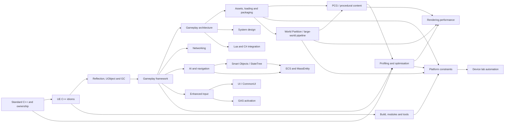

# Unreal Engine Interview Learning Plan

## Learner and target

This curriculum targets a generalist Unreal Engine engineer with roughly three years of experience. The baseline is not source-level mastery of every subsystem. It is the ability to use P0/P1 systems safely, diagnose normal failures, explain architectural trade-offs, and recognise where specialist depth begins.

**Version target:** UE5.3–UE5.6. Stable UE4/UE5 ideas remain included; changed, deprecated, experimental, and plugin-dependent guidance is labelled at the point of use.

## Priority and depth

| Marker | Meaning |
|---|---|
| P0 | Essential in a broad UE interview |
| P1 | Very common; strong working knowledge expected |
| P2 | Common follow-up; medium depth expected |
| P3 | Role-dependent specialist topic |
| P4 | Advanced differentiation |
| D1–D2 | Recognise, explain, and use normally |
| D3 | Diagnose common failures |
| D4 | Design and defend trade-offs |
| D5 | Internals or advanced extensibility |

## Dependency-aware tracks

| Track | Default priority/depth | Core outcome |
|---|---|---|
| Standard C++ and UE C++ idioms | P0–P1 / D3–D4 | Reason correctly about value, lifetime, ownership, containers, APIs, and build boundaries. |
| UObject, reflection, lifetime | P0 / D4 | Select safe reference types and explain what reflection and GC actually do. |
| Gameplay framework and C++/Blueprint | P0–P1 / D3–D4 | Place responsibilities correctly across Actor, Component, Controller, state classes, subsystems, C++, and Blueprint. |
| Architecture, patterns, and system design | P0–P2 / D2–D4 | Design data-driven, testable, multiplayer-ready gameplay systems. |
| Networking | P0–P2 / D2–D4 | Reason from authority, ownership, relevance, and prediction; debug failed replication systematically. |
| AI and navigation | P1–P3 / D2–D4 | Build and debug decision-making, perception, pathfinding, avoidance, StateTree and Smart Object interactions. |
| Rendering and profiling | P1–P3 / D2–D4 | Identify the limiting thread/resource before changing content or code, then prove results on target platforms and automated device-lab gates. |
| Assets, build, editor, and tools | P1–P3 / D2–D4 | Make modular, cook-safe workflows and diagnose editor/package/procedural generation/world-building differences. |
| MassEntity/ECS and modern UE5 | P2–P3 / D1–D3 | Explain use cases and build a small data-oriented slice without forcing ECS everywhere. |
| Lua/C# integration | P3–P4 / D1–D3 | Explain plugin boundaries, interop, lifetime, debugging, and role relevance. |

## Role overlays

| Role | Highest-priority overlay | Breadth-only unless role demands it |
|---|---|---|
| Gameplay engineer | Object model, framework, architecture, C++/Blueprint, networking | RDG internals, advanced Mass |
| AI/gameplay engineer | Gameplay foundation, navigation, BT/StateTree, perception, profiling | shader internals, editor customisation |
| Rendering/graphics engineer | C++, maths, frame pipeline, GPU profiling, shaders/RDG | deep GAS, quest architecture |
| Networking engineer | Gameplay foundation, authority/ownership, replication, prediction, profiling | content authoring details |
| Engine/tools engineer | C++, object model, modules, assets/cooking, editor APIs | specialist animation authoring |
| Technical designer/artist | Blueprint architecture, data assets, UI/animation/VFX, profiling | C++ memory-model internals |
| Engine generalist | P0/P1 breadth plus debugging and profiling workflows | D5 depth chosen per job |

## Current learning unit

Follow the dependency path: [standard C++ lifetime and ownership](../topics/cpp_for_unreal_interviews.md) → [UE C++ reflection, UObject lifetime, and pointers](../topics/ue_cpp_idioms.md) → [gameplay framework and system design](../topics/game_architecture_patterns.md) plus [game patterns](../topics/game_programming_patterns.md). Then branch into [networking](../topics/ue_networking_and_replication.md), [AI/navigation](../topics/ue_ai_navigation.md), [profiling](../topics/ue_profiling_optimisation.md), [rendering/GPU performance](../topics/ue_rendering_graphics_performance.md), [assets/loading/cooking](../topics/ue_assets_loading_cooking.md), [World Partition and large-world pipeline](../topics/ue_world_partition_large_world_pipeline.md), [platform constraints](../topics/ue_platform_constraints.md), and [device lab automation](../topics/ue_device_lab_automation.md). Each chapter's completion standard includes explanation, diagnosis, architecture trade-offs and its linked hands-on/practice evidence.

## Scope preservation map

The planned grouped files preserve the full `research.md` taxonomy:

- `topics/cpp_for_unreal_interviews.md`: standard C++, memory, templates, concurrency, performance, STL, toolchain.
- `topics/ue_cpp_idioms.md`: UE types plus object system, reflection, GC, lifetime, and core idioms.
- `curriculum/ue_interview_learning_plan.md` and UE-system chapters: gameplay framework, Blueprint, Enhanced Input, networking, AI, Smart Objects/StateTree, PCG, World Partition/large-world pipeline, Mass, GAS, rendering, profiling, platform constraints, device lab automation, assets, build/tools, animation, physics, UI, audio, VFX, modern UE5.
- `topics/game_programming_patterns.md` and `topics/game_architecture_patterns.md`: patterns, real-time architecture, and system design.
- `topics/game_algorithms_and_data_structures.md` and `topics/game_math_for_interviews.md`: algorithms, spatial structures, maths, and rendering spaces.
- `topics/scripting_integration_lua_csharp.md`: Lua and C# runtime/tooling integration.
- `practice/` and `curriculum/`: all interview, project, flashcard, schedule, and gap-analysis artefacts.
