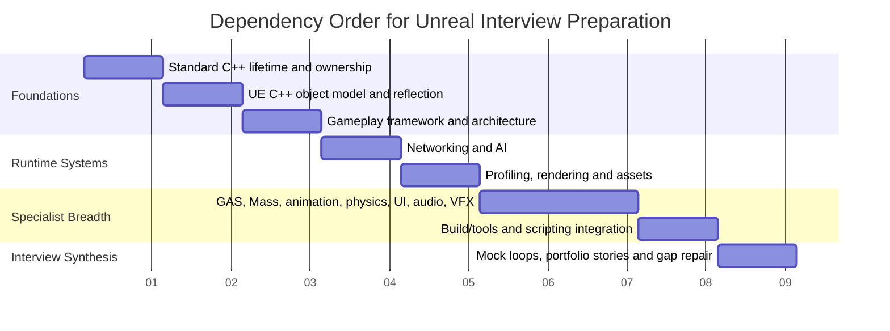
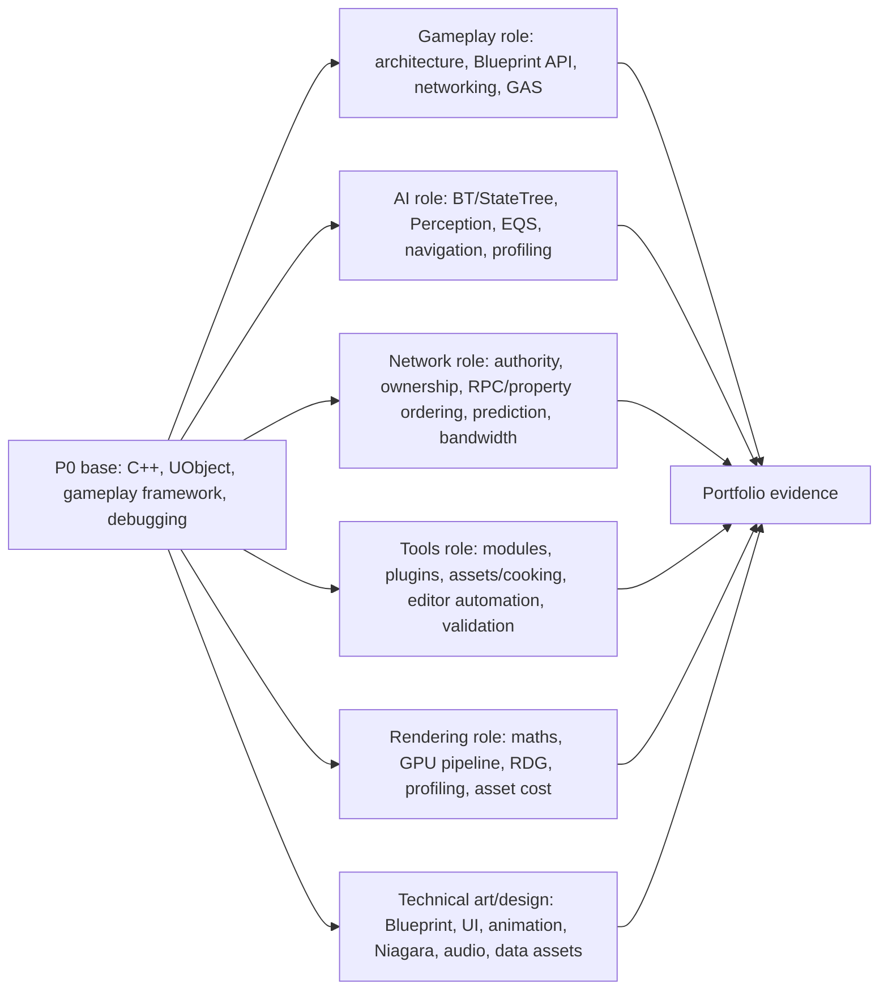
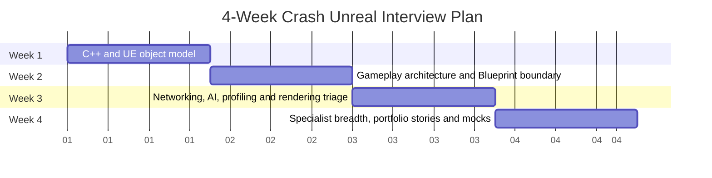
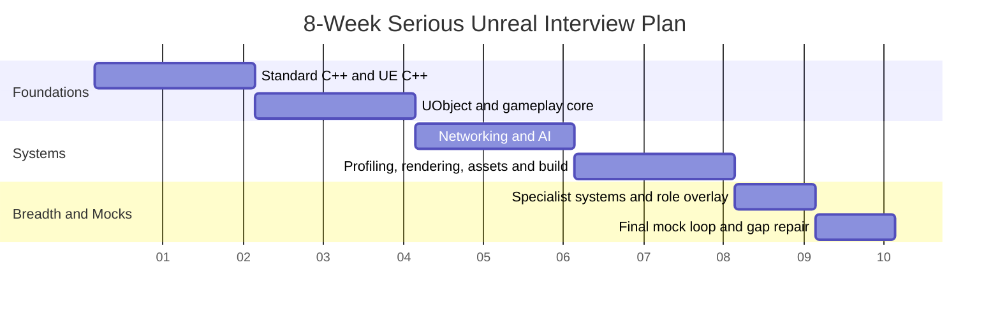
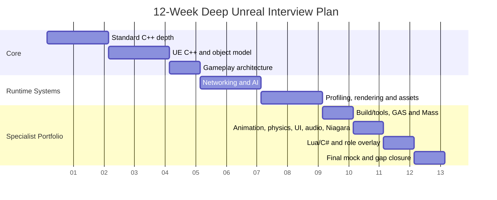

# Unreal Engine Interview Study Schedules

These schedules turn the topic chapters, practice banks and projects into dependency-aware study plans. They assume the learner already programs in C++ but needs interview-ready Unreal Engine fluency across UE5.3-UE5.6. If a topic is labelled maintained UE5.7, UE4-era, experimental or plugin-dependent in the chapter/source index, treat it as awareness until checked against the target branch.

## How to Use These Plans

Every week should produce evidence, not only notes. The minimum evidence set is:

- one corrected explanation in your own words;
- one implemented or instrumented hands-on task;
- one debugging transcript or profiler capture when the topic has runtime behaviour;
- one mock answer recorded against the question bank;
- flashcard review until weak P0/P1 cards are no longer missed twice in a row.

Use these source families as anchors:

| Area | Primary source anchors |
|---|---|
| Standard C++ | Core Guidelines and C++ references for lifetime, ownership, templates, memory model and sanitizers [SRC-CPP-001] [SRC-CPP-002] [SRC-CPP-020] [SRC-CPP-030] |
| UE object model and C++ | Reflection, UHT, UObject, pointers, specifiers, interfaces, logging/asserts and async proxy APIs [SRC-EPIC-001] [SRC-EPIC-002] [SRC-EPIC-003] [SRC-EPIC-009] [SRC-EPIC-032] [SRC-EPIC-037] [SRC-EPIC-038] [SRC-EPIC-039] [SRC-EPIC-044] |
| Gameplay framework | Actor/Component, GameMode/GameState/PlayerState and subsystem roles [SRC-EPIC-010] [SRC-EPIC-011] [SRC-EPIC-012] [SRC-EPIC-013] [SRC-EPIC-017] |
| Networking and AI | Replication authority, RPC/property ordering, movement prediction, Behaviour Trees, StateTree, Perception, EQS and nav debugging [SRC-NET-001] [SRC-NET-005] [SRC-NET-006] [SRC-NET-009] [SRC-AI-002] [SRC-AI-003] [SRC-AI-004] [SRC-AI-008] |
| Profiling/rendering/assets/build | Insights/stat tools, RDG, Nanite/Lumen/VSM, hard/soft references, Asset Manager, UBT/modules/plugins and Live Coding [SRC-PERF-001] [SRC-PERF-003] [SRC-RENDER-003] [SRC-RENDER-005] [SRC-ASSET-001] [SRC-ASSET-003] [SRC-BUILD-001] [SRC-BUILD-006] |
| Specialist systems | MassEntity, GAS, animation, physics, UI, audio, Niagara and scripting sources are used after the P0/P1 foundation is stable [SRC-MASS-001] [SRC-GAS-001] [SRC-ANIM-015] [SRC-PHYS-001] [SRC-UI-005] [SRC-AUDIO-007] |

## Daily Operating Loop

| Block | Target time | Output |
|---|---:|---|
| Recall | 20-30 min | Review flashcards and answer 2 old questions without notes. |
| Source-grounded reading | 45-75 min | Read one chapter section and inspect the cited official/API source. |
| Implementation or trace | 60-120 min | Build, instrument, or deliberately break the relevant project slice. |
| Interview conversion | 30-45 min | Turn the day into one strong answer pattern plus one "what I would check next" note. |
| Error log | 10 min | Record misconceptions, version caveats and missing evidence. |

## Global Dependency Timeline

## Role Overlay Graphic

## 4-Week Crash Plan

Use this plan when an interview is close and breadth matters more than specialist mastery. The rule is: P0/P1 correctness first, then one role-specific spike, then mock repetition.

| Week | Topics | Must Finish | Should Finish | Optional Deep Dive | Hands-On | Mock Interview Focus |
|---:|---|---|---|---|---|---|
| 1 | Standard C++; UE C++ idioms; UObject, reflection, GC, pointers, specifiers and diagnostics | Explain C++ lifetime versus UObject lifetime; choose `UPROPERTY`, `TObjectPtr`, `TWeakObjectPtr`, soft pointers, `TSharedPtr`; explain CDO and constructor rules; answer all P0 object questions | Build Project 7A baseline plus the specialist contract extension enough to prove config/save/transient, interfaces and async proxy lifetime | Sanitizer setup and task/thread boundary caveats | Implement a small Actor/Component with reflected fields, a native helper, an async callback and a deliberate dangling-reference fix | "How do you keep UObject references alive and debug an invalid object crash?" |
| 2 | Actor/Component, Pawn/Controller/state classes, subsystems, Blueprint API design, gameplay patterns and system design | Place state across GameMode/GameState/PlayerState/Pawn/Controller; design one health/damage or inventory system; explain Blueprint exposure policy | Build Project 1 core loop and one Project 8/9 design slice | Save/load schema and event bus/service locator trade-offs | Produce one system design diagram and walk through server/client/UI/animation responsibilities | "Design a multiplayer-ready gameplay system without putting truth in UI/animation." |
| 3 | Networking; AI/navigation; profiling; rendering; assets/loading/cooking | Explain authority/ownership/RPC/property replication; debug missing `OnRep`; contrast pathfinding and avoidance; classify CPU/GPU/network/loading bottlenecks | Capture one Insights/stat/network trace; implement soft-load or replication failure exercise | CharacterMovement prediction, RDG, Nanite/Lumen/VSM and Asset Manager bundles | Reproduce one replication bug, one AI path bug and one performance regression with evidence | "You see lag, wrong AI movement and frame spikes. What do you inspect first?" |
| 4 | Build/modules/tools; GAS/Mass; animation/physics/UI/audio/Niagara; Lua/C#; final mocks | Know what each specialist system is for, common failure modes, version/plugin caveats and when not to use it | Prepare 6 portfolio stories using STAR plus technical evidence; complete 3 timed mock interviews | One role-specific spike: GAS ability, Mass crowd, UI list, tool commandlet, or rendering capture | Run a 90-minute mini vertical slice and produce a final risk/next-step memo | Full-system design, debugging workflow and "tell me about a bug you solved" |

### 4-Week Sub-Weekly Focus

| Week | Day 1-2 | Day 3-4 | Day 5 | Day 6 | Day 7 |
|---:|---|---|---|---|---|
| 1 | C++ lifetime, RAII, move, ownership | UObject/reflection/GC/pointers | Specifiers/config/save/diagnostics | Project 7A implementation | Mock + flashcard repair |
| 2 | Framework roles and lifecycle | Components/subsystems/Blueprint API | Patterns and architecture canvas | One system design implementation | Mock + rewrite weak answers |
| 3 | Networking authority/RPC/properties | AI BT/StateTree/Perception/Nav | Profiling/render/assets triage | Failure reproduction with traces | Mock + compare diagnoses |
| 4 | Build/tools and packaging | GAS/Mass and specialist systems | Role-specific spike | Portfolio stories | Full mock and final gap list |

## 8-Week Serious Plan

Use this plan for balanced preparation. It gives every P0/P1 area an implementation checkpoint and leaves room for one role overlay.

| Week | Topics | Must Finish | Should Finish | Optional Deep Dive | Hands-On | Mock Interview Focus |
|---:|---|---|---|---|---|---|
| 1 | Standard C++ lifetime/value/ownership | RAII, Rule of Zero/Five, move semantics, pointer ownership, invalidation and C++ versus UObject lifetime | Project 7B lifetime/ownership exercises | Custom allocators and sanitizer setup | Implement value/ownership examples and one ASan-detected bug | "Explain lifetime, ownership and moved-from state without hand-waving." |
| 2 | Standard C++ specialist depth plus UE containers/types | Templates/concepts, lambdas/type erasure, memory model, `TArray`/`TMap`/`FName`/`FText`, delegates | Callable lifetime and data-race notes | `std::pmr`, `ParallelFor`/Tasks and TSan limitations | Build callable/storage/thread examples and convert them into interview traps | "When do templates, lambdas and atomics become production bugs?" |
| 3 | UE reflection, UObject, GC, CDO, construction, specifiers | UHT/generated-code model, CDO/default subobjects, pointer matrix, `UPROPERTY` flags, config/save/transient | Project 7A specialist extension | `FGCObject`, async Blueprint proxies, metadata caveats | Build reflected interface, native interface, config/save/load and async proxy tests | "Why did this property not appear, save, replicate or survive GC?" |
| 4 | Gameplay framework and system architecture | Actor/Component/Pawn/Controller/state/subsystems plus health/inventory/interaction/save/UI projection designs | Project 1 and one Project 8/9 design | Transactions, data-driven tuning and test seams | Implement a small multiplayer-ready gameplay slice with state placement notes | "Where does this responsibility belong, and why?" |
| 5 | Networking | Authority, roles, ownership, RPCs, replicated properties, ordering, relevancy, dormancy, movement prediction awareness | Project 3 baseline with one bandwidth capture | Fast Array, subobjects, RepGraph/Iris awareness | Reproduce missing RPC, stale `OnRep`, dormancy and relevancy failures | "Debug a replication failure from first principles." |
| 6 | AI/navigation and algorithms/maths | BT/StateTree/Perception/EQS/NavMesh/avoidance; A*, spatial structures, transforms, quaternions and sweep math | Project 2 plus Project 7C selected tasks | Smart Objects, MassAI, numeric robustness | Build one AI agent and one visual maths/pathfinding test | "Separate decision logic, pathfinding, avoidance and movement." |
| 7 | Profiling, rendering, assets, build/tools | Stat/Insights triage; CPU/GPU/memory/loading; render passes/costs; hard/soft refs; cook/package; UBT/modules/plugins | Project 4 render/perf matrix and Project 6 design proof | RDG/shaders/PSOs, World Partition, BuildGraph | Capture traces for one CPU, one GPU and one loading/package failure | "Show me your bottleneck diagnosis order." |
| 8 | GAS/Mass/animation/physics/UI/audio/Niagara/Lua/C# and mocks | Know adoption criteria, lifetimes, failure modes, plugin/version caveats and role-specific talking points | One role overlay spike and three timed mocks | A second specialist spike if the job requires it | Produce a portfolio evidence packet: diagrams, traces, code snippets and postmortems | Full loop: architecture, bug, performance and trade-off questions |

### 8-Week Sub-Weekly Focus

| Week | First half | Second half | Retrieval task |
|---:|---|---|---|
| 1 | C++ object lifetime, RAII, copy/move | Ownership and invalidation | 10 C++ questions, 30 cards |
| 2 | Templates/callables/layout | Concurrency/tasks/linking/toolchain | Explain one undefined behaviour and one race |
| 3 | Reflection/UHT/UObject/GC | Specifiers/interfaces/async/diagnostics | Build and break Project 7A |
| 4 | Framework/lifecycle | Architecture/patterns/system design | Whiteboard one system and critique it |
| 5 | Replication mechanics | Prediction/relevancy/debug/profiling | Reproduce and fix two net bugs |
| 6 | AI/navigation | Algorithms/maths verification | Derive A* and one transform/intersection |
| 7 | Profiling/render/assets | Build/tools/cook/package | Produce a trace-led diagnosis report |
| 8 | Specialist breadth | Mock loop/portfolio/gap repair | Three timed mocks and final weak-area list |

## 12-Week Deep Plan

Use this plan when the goal is broader mastery, portfolio alignment and stronger senior-intermediate signals. It spends time on evidence quality and specialist trade-offs rather than just coverage.

| Week | Topics | Must Finish | Should Finish | Optional Deep Dive | Hands-On | Mock Interview Focus |
|---:|---|---|---|---|---|---|
| 1 | C++ lifetime, ownership and value categories | Explain storage/lifetime/ownership/value category separately; implement RAII and copy/move cases | Benchmark copy/move/noexcept relocation patterns | ABI/layout and `std::pmr` awareness | Project 7B ownership tasks | C++ fundamentals under pressure |
| 2 | C++ templates, callables, memory model, tasks and toolchain | Explain forwarding, constraints, lambda capture, `std::function` cost, atomics, happens-before, ODR and sanitizers | Build one data-race repro and one linker/ODR repro | Task graph/Unreal Tasks exact target API | Project 7B specialist experiments | Diagnosing "works in editor, fails in package/threaded build" |
| 3 | UE reflection, UObject, GC and pointers | Explain UHT, generated headers, CDOs, construction, GC roots and pointer wrappers | Build pointer/reference decision examples | Incremental GC and target-branch pointer API checks | Project 7A core | UObject lifetime and creation |
| 4 | UE C++ specialist contracts | Specifiers/metadata, config/save/transient, `NewObject`/`DuplicateObject`/`FindObject`/`LoadObject`, interfaces, logging/asserts, async Blueprint proxy, `FGCObject` | Write one style guide for property exposure and diagnostics | Custom thunks, metadata-heavy editor tools | Project 7A specialist extension | "Name the consuming system" specifier reasoning |
| 5 | Gameplay framework and architecture | Actor/Component/Controller/state/subsystem placement; system design canvas; patterns | Implement Project 1 with test seams and UI projection | Save/load migration and data validation | Project 1 plus Project 8/9 slice | System design from requirements to failure modes |
| 6 | Networking | Replication, RPCs, roles, ownership, ordering, relevancy, dormancy, movement prediction | Network Profiler/Insights evidence | Fast Array/subobject/RepGraph/Iris specialist pass | Project 3 | Multiplayer bug diagnosis and authority design |
| 7 | AI/navigation plus algorithms/maths | BT/StateTree/Perception/EQS/NavMesh/avoidance; A*/graphs/spatial structures; transforms/intersections/quaternions | Project 2 and Project 7C visual proof | Smart Objects, MassAI, GOAP/HTN awareness | AI patrol/combat prototype plus maths harness | Decision versus movement versus navigation |
| 8 | Profiling and rendering | Frame budgets, stat/Insights, CPU/GPU/memory/loading; render pipeline, material/geometry/pixel/bandwidth costs | Project 4 CPU/GPU/memory matrix | RDG, PSO/shader and platform capture spike | Trace-led optimisation report | Evidence-first performance answers |
| 9 | Assets, loading, cooking, build/modules/tools | Hard/soft references, Asset Manager, DDC, redirectors, cook/package; UBT/modules/plugins/editor automation | Project 6 commandlet/validator/tools proof | BuildGraph, install bundles, OFPA/World Partition specialist pass | Package-only failure reproduction | Editor-safe and package-safe workflows |
| 10 | GAS and MassEntity | GAS adoption/lifecycle/effects/tags/prediction; Mass fragments/queries/processors/representation/LOD | GAS vertical slice and Mass crowd comparison | Replication internals and MassAI | Project 5 and Project 9 extension | "When would you not use this framework?" |
| 11 | Animation, physics, UI, audio, Niagara | Runtime ownership, threading, authority boundaries, profiling and failure tools per subsystem | One specialist mini-lab matching target role | Motion Warping/Pose Search/CommonUI/MetaSounds version checks | Project 1/4/9 extensions | Presentation systems versus gameplay truth |
| 12 | Lua/C# integration, portfolio synthesis and final mocks | Explain native/script/managed lifetime, GC bridges, reload/security/package caveats; finish gap repair | Project 10 design memo and role-specific portfolio packet | Prototype one integration if role requires it | Three full mocks and final evidence review | End-to-end architecture, debugging, performance and trade-off defence |

### 12-Week Sub-Weekly Focus

| Phase | Weeks | Focus | Evidence checkpoint |
|---|---:|---|---|
| Foundation proof | 1-4 | C++ and UE object/C++ contracts | 20 strong answers, Project 7A/7B evidence, source caveat list |
| Gameplay proof | 5-7 | Framework, architecture, networking, AI, algorithms and maths | One multiplayer-ready slice, one AI slice, one verification harness |
| Runtime proof | 8-9 | Profiling, rendering, assets, cooking, build and tools | Trace-led optimisation report plus package-safe tool result |
| Specialist proof | 10-11 | GAS, Mass, animation, physics, UI, audio and Niagara | Two role-aligned specialist demos with failure matrices |
| Interview proof | 12 | Lua/C# awareness, mocks, portfolio, gap closure | Three timed mocks, final weak-area log and portfolio narrative |

## Mock Interview Ladder

| Stage | Timing | Format | Pass Standard |
|---|---|---|---|
| Recall drill | Daily | 5 flashcards + 2 short questions | Correct without reading, or marked for same-week repair. |
| Narrow topic mock | Weekly | 30 minutes on the current topic | Answer includes what/why/how, common bug, debug workflow and version caveat. |
| Cross-system mock | Every 2 weeks | 45 minutes combining gameplay, networking, performance and build/package | Candidate identifies ownership, authority, lifetime and evidence before proposing fixes. |
| Portfolio mock | Final 2 weeks | 60 minutes using a real project artefact | Candidate can explain design constraints, implementation, bug, trace/evidence and trade-off. |
| Full loop mock | Final week | 90 minutes: C++, UE core, system design, runtime bug, performance bug | Candidate can recover after a weak answer by naming a verification plan. |

## Portfolio Evidence Packet

By the end of any plan, collect a folder or document with:

- system diagrams for one gameplay feature and one runtime subsystem;
- snippets showing UObject lifetime, specifier choices and async cancellation;
- a replication failure and fix with logs or Network Profiler/Insights evidence;
- a performance issue before/after with frame-time units rather than FPS alone;
- a packaged-build or cook/load failure and fix;
- a role-specific specialist slice, labelled plugin/version-sensitive where appropriate;
- a one-page "things I would verify in the target branch" list.

## Choosing Optional Deep Dives

| Target role | First optional deep dive | Second optional deep dive |
|---|---|---|
| Gameplay | GAS or system design portfolio | Networking prediction/lag compensation awareness |
| AI/gameplay | StateTree/EQS/Smart Objects | MassAI or scalable perception |
| Networking | Fast Array/subobjects/RepGraph/Iris | Character movement prediction and lag compensation |
| Engine/tools | Build modules/plugins/editor commandlets | Asset Manager/cook/package/validation pipeline |
| Rendering/graphics | RDG/shaders/PSOs/platform captures | Nanite/Lumen/VSM limits and profiling |
| Technical art/design | Blueprint API, UI, animation and Niagara | Asset pipeline, data validation and performance budgets |
| Generalist | One gameplay vertical slice | One trace-led optimisation story |

## Stop Conditions Before Interview Week

Do not keep reading if any of these are still failing:

- You cannot explain why `TSharedPtr` does not keep a UObject alive.
- You cannot place GameMode/GameState/PlayerController/PlayerState responsibilities.
- You cannot debug a client RPC that never arrives.
- You cannot classify a frame spike as Game Thread, Render Thread, GPU, loading, GC or network evidence.
- You cannot describe one packaged-only asset/build failure.
- You cannot give one concrete bug story with logs/traces and a prevention rule.

When a stop condition fails, spend the next session repairing that item with one source, one chapter section, one implemented or inspected example and one mock answer.
