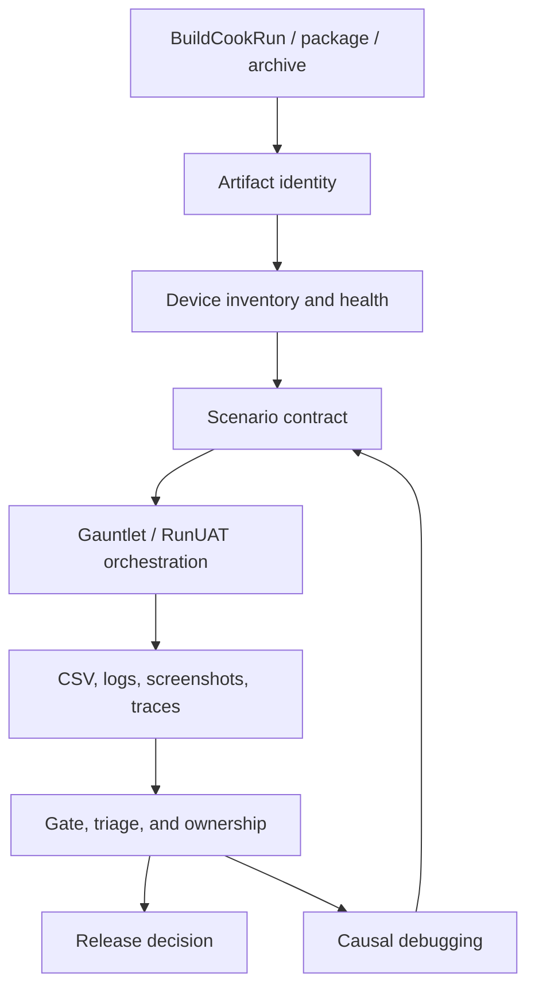

# Unreal Device Lab Automation and Target Evidence

See also: [[ue_platform_constraints]], [[ue_profiling_optimisation]], [[ue_packaged_performance_build_worldpartition_proof]], [[ue_android_platform_profiling_workbook]], [[ue_apple_console_profiling_workbook]].

## Scope

This chapter covers the specialist workflow that turns individual packaged-build, profiling and platform-readiness checks into a repeatable device-lab evidence system. It is aimed at P2/P3 depth for gameplay, tools, rendering, networking and engine-generalist interviews.

It assumes the reader already understands packaged builds, AutomationTool/RunUAT, BuildGraph, CSV profiling, Unreal Insights, Device Profiles, scalability and platform artifact contracts. This chapter does not invent console certification rules or claim that public documentation is enough for a real console submission. Confidential platform-holder checklists remain the authority for exact certification details. [SRC-BUILD-015] [SRC-BUILD-016] [SRC-BUILD-017] [SRC-BUILD-018] [SRC-PERF-001] [SRC-PERF-003] [SRC-PERF-009] [SRC-PERF-011] [SRC-PLAT-009]

## What It Is

A device lab is not just a shelf of phones, PCs or consoles. In engineering terms, it is a controlled evidence pipeline:

1. Produce a reproducible packaged artifact.
2. Install it on known target devices.
3. Launch deterministic smoke, performance, lifecycle and failure scenarios.
4. Capture logs, CSV telemetry, traces, screenshots, crash data, symbols, manifests and device state.
5. Attach every result to the exact build, device, scenario and command line.
6. Classify failures into product bugs, environment issues, test flaws or expected platform constraints.
7. Feed stable gates into CI while keeping noisy investigations out of release-blocking paths.

The hard part is not writing one script that launches the game. The hard part is preserving causal evidence when the failure occurs only on a device, only after a warm install, only under thermal pressure, only after a suspend/resume sequence, or only when a content package is staged differently from the editor. [SRC-BUILD-017] [SRC-PERF-001] [SRC-PERF-009] [SRC-PLAT-005] [SRC-PLAT-007] [SRC-PLAT-008]

## Why It Exists

Editor play and local desktop launches hide several production classes of failure:

| Hidden class | Why editor/local proof is weak | Device-lab evidence |
|---|---|---|
| Cook/stage defects | Editor can load loose or already-loaded assets | cook/stage manifest, packaged launch log, missing-asset injection |
| Profile/scalability defects | Local machine may select different CVars | applied Device Profile and scalability dumps from target |
| Shader/PSO hitches | Warm DDC and editor paths hide first-use cost | fresh packaged run, PSO/cache evidence, hitch CSV |
| Memory growth | Short local run misses retention or thermal behaviour | repeated scenario loops, LLM/Memory Insights checkpoints |
| Platform lifecycle bugs | PIE does not model app backgrounding, input loss or OS interruptions | suspend/resume, focus/input/network/storage matrix |
| Native/plugin staging bugs | Dev machine has global installs or editor-adjacent binaries | clean install on a clean device with artifact manifest |
| Crash diagnosis gaps | local callstacks may match current workspace, not shipped artifact | archived symbols and forced-crash symbolication proof |

An interview-grade answer should frame device-lab automation as evidence management, not just automation convenience. [SRC-BUILD-018] [SRC-PERF-006] [SRC-PERF-010] [SRC-PLAT-003] [SRC-PLAT-004]

## What A 3-Year Engineer Should Know

A strong generalist should be able to:

- Explain why packaged target evidence is different from editor evidence.
- Define a device/scenario matrix with a small number of representative runs.
- Preserve build identity: engine revision, project revision, platform, configuration, package ID, command line, build ID, symbols and manifests.
- Use AutomationTool/RunUAT and, where appropriate, BuildGraph to separate build, cook, package, deploy, run, test and archive steps. [SRC-BUILD-015] [SRC-BUILD-016] [SRC-BUILD-017]
- Use CSV telemetry for broad repeated runs and Unreal Insights/Memory Insights for narrow causal investigation. [SRC-PERF-003] [SRC-PERF-006] [SRC-PERF-009]
- Treat Gauntlet/RunUnreal as a way to orchestrate UE-aware packaged runs and automation tests, while verifying exact command classes and platform support in the target branch. [SRC-PLAT-009]
- Distinguish product regression from lab noise, device state, test design error and environment/toolchain failure.
- Avoid claiming confidential certification details; instead, describe how to translate authorised platform-holder requirements into evidence rows.

## Specialist Depth

Specialist depth starts when the engineer can design the lab as a product:

- device reservation, health checks and reset policy;
- build distribution, install caching and clean-install versus incremental-install lanes;
- farm-visible artifacts and stable run identifiers;
- UAT/Gauntlet integration with project-specific controllers;
- automated crash upload and symbol lookup;
- statistical gate design with variance bands;
- flake quarantine and rerun policy;
- platform profiler capture hooks;
- privacy/security policy for logs, user IDs and crash payloads;
- ownership model for failures that move between build, content, platform and test-infrastructure teams.

Exact implementation is studio- and platform-specific. The source-traceable principle is that Unreal exposes AutomationTool/BuildGraph, Automation System, CSV/Insights and Gauntlet/RunUnreal-style automation hooks; the production lab must verify commands, device adapters and capture tooling against the target engine and platform. [SRC-BUILD-015] [SRC-BUILD-016] [SRC-PERF-011] [SRC-PLAT-009]

## Prerequisites And Dependents



| Input topic | Why it matters |
|---|---|
| BuildGraph and AutomationTool | Builds and test runs must be reproducible, parameterised and visible. |
| Packaging/cooking | Device failures often start as missing cooked assets, wrong staged files or package metadata. |
| CSV Profiler and Unreal Insights | Broad repeated telemetry and narrow causal traces serve different purposes. |
| Device Profiles and scalability | A device-lab run must prove the actual CVars and quality tier in use. |
| Platform readiness | Lifecycle, crash, input, network and storage states must be explicit scenarios. |

## Device Matrix Design

Do not start with every device. Start with the smallest matrix that protects the product's likely failure modes.

| Tier | Purpose | Example evidence | Gate type |
|---|---|---|---|
| Dev smoke | Fast feedback after package | launch, map load, automation smoke, log scan | blocking |
| Low supported device | Capacity and readability floor | P95/P99 frame time, LLM, texture pool, safe area, input | blocking near release |
| Target/common device | Main user experience | scenario frame data, hitch count, crash/lifecycle matrix | blocking |
| High device | Regression and feature ceiling | visual/quality path, optional expensive features, shader/PSO coverage | warning or blocking by feature |
| Long soak device | retention and thermals | repeated loops, memory growth, power/thermal notes | nightly/release candidate |

The matrix should record OS, SDK/toolchain, GPU/driver if visible, storage state, power/thermal mode, screen resolution, package variant, controller/input device and whether the install was clean or incremental. [SRC-PLAT-001] [SRC-PLAT-002] [SRC-PLAT-005] [SRC-PERF-001]

## Scenario Contract

A useful automated scenario is a contract, not a vague instruction to "play the level".

```cpp
USTRUCT(BlueprintType)
struct FTargetScenarioSpec
{
    GENERATED_BODY()

    UPROPERTY(EditAnywhere)
    FName ScenarioId;

    UPROPERTY(EditAnywhere)
    FSoftObjectPath Map;

    UPROPERTY(EditAnywhere)
    int32 Seed = 0;

    UPROPERTY(EditAnywhere)
    float WarmupSeconds = 20.0f;

    UPROPERTY(EditAnywhere)
    float SampleSeconds = 120.0f;

    UPROPERTY(EditAnywhere)
    FString CameraPathAsset;

    UPROPERTY(EditAnywhere)
    TMap<FName, FString> RequiredCVarEvidence;
};
```

The exact code shape is project-specific, but the contract should capture:

- scenario ID and owner;
- map, mode, content pack and feature flags;
- deterministic seed and scripted input/camera path;
- warm-up and sample windows;
- expected automation exit condition;
- required CVars/profile proof;
- telemetry channels;
- acceptable variance/tolerance;
- artifact paths;
- known non-deterministic inputs.

Without this contract, a failed run can only tell you that "something was different". With the contract, you can ask whether the build changed, the scenario changed, the device changed, or the product regressed. [SRC-PERF-009] [SRC-PERF-011]

## Artifact Identity

Every run should carry a manifest. Keep it small enough to inspect in a failure ticket.

```json
{
  "run_id": "2026-06-23T10-30Z_android_low_combat_peak_042",
  "project_commit": "abc1234",
  "engine_revision": "ue5.6-target-branch",
  "build_id": "CL-123456-Shipping-Android-arm64",
  "platform": "Android",
  "configuration": "Shipping",
  "package_path": "artifacts/packages/CL-123456/Android",
  "symbols_path": "artifacts/symbols/CL-123456/Android",
  "scenario_id": "combat_peak",
  "device_id": "lab-pixel-low-04",
  "install_mode": "clean",
  "command_line": "-ExecCmds=csvprofile start; ...",
  "outputs": {
    "log": "logs/combat_peak.log",
    "csv": "csv/combat_peak.csv",
    "trace": "traces/combat_peak.utrace",
    "screenshot": "screens/combat_peak.png"
  }
}
```

Do not rely on the build farm URL alone. URLs expire and systems get migrated. The manifest should be copied with the package, symbols, logs, manifests, validation reports and test output. [SRC-BUILD-018] [SRC-PLAT-007] [SRC-PLAT-008]

## Gauntlet / RunUnreal Mental Model

Epic's Gauntlet documentation exposes `RunUnreal` as the main UE-oriented command for running tests, with built-in workflows such as boot tests, editor automation, target automation, networking and process lifetime management. It also shows target platform command-line shape with `-platform` and `-device`, and notes that deploying console/mobile builds depends on implementing target-device integration interfaces. [SRC-PLAT-009]

Interview-level phrasing:

> I would not build a release gate by hand-clicking devices. I would package with AutomationTool/BuildGraph, then run target smoke/performance/lifecycle scenarios through a UE-aware runner such as Gauntlet/RunUnreal where it fits. I would verify exact commands, device adapters and project controllers in the target branch, then archive logs, CSVs, traces, screenshots, manifests and symbols per run. [SRC-BUILD-015] [SRC-BUILD-016] [SRC-PLAT-009]

Example command shapes from the public workflow:

```bat
RunUAT.bat BuildCookRun ^
  -project=Samples/Games/Lyra/Lyra.uproject ^
  -platform=Win64 ^
  -configuration=Development ^
  -build -cook -pak -stage

RunUAT.bat RunUnreal ^
  -project=Samples/Games/Lyra ^
  -platform=Win64 ^
  -configuration=Development ^
  -build=local ^
  -test=LyraTest.BootTest

RunUAT.bat RunUnreal ^
  -test=UE.TargetAutomation ^
  -runtest=Project.TargetSmoke ^
  -project=<path to uproject> ^
  -build=<path to packaged game> ^
  -platform=<platform> ^
  -device=<ip>:<platform>
```

Treat this as workflow shape, not copy-paste production policy. Installed engine location, shell, target branch, platform devices, build path and test names must be checked in the real environment. [SRC-BUILD-016] [SRC-BUILD-017] [SRC-PLAT-009]

## Sample Gauntlet Node Shape

The public Gauntlet example demonstrates a `UnrealTestNode<UnrealTestConfiguration>` that requires a client role, adds command-line parameters and uses a duration limit. The exact API and project layout must be verified against the target branch. [SRC-PLAT-009]

```csharp
using Gauntlet;

namespace ProjectDeviceLab
{
    public class DeviceSmokeTest : UnrealTestNode<UnrealTestConfiguration>
    {
        public DeviceSmokeTest(UnrealTestContext context)
            : base(context)
        {
        }

        public override UnrealTestConfiguration GetConfiguration()
        {
            UnrealTestConfiguration config = base.GetConfiguration();

            UnrealTestRole client = config.RequireRole(UnrealTargetRole.Client);
            client.CommandLineParams.Add("TargetScenario", "smoke_frontend");
            client.CommandLineParams.Add("ExecCmds", "Automation RunTests Project.TargetSmoke; Quit");

            config.MaxDuration = 10 * 60;
            return config;
        }
    }
}
```

For a project lab, avoid stuffing all logic into the C# runner. Let the game expose a narrow scenario controller and let the runner select build, device, scenario and command line. That keeps scenario semantics testable inside the project and lab orchestration testable outside it.

## Telemetry Tiers

| Tier | Use | Cost | Typical artifact |
|---|---|---:|---|
| log scan | boot/package/cook/stage failure and fatal/assert detection | low | target log |
| CSV | repeated frame, hitch, counter and memory telemetry | low/medium | `.csv` |
| screenshot/video | visual smoke, UI safe area, black screen, shader fallback | medium | image/video |
| Unreal Insights | short CPU/thread/loading/network causal traces | medium/high | `.utrace` |
| Memory Insights | allocation lifetime and memory growth investigations | high | memory trace |
| GPU Visualiser/external GPU capture | pass/pipeline/resource diagnosis | high | capture file/screenshots |
| platform profiler | OS/GPU/thermal/power platform behaviour | high | platform-specific |

Run CSV frequently. Run heavy traces only for selected scenarios, sampled runs or failed gates. A lab that records everything at maximum detail can become too slow, too noisy and too expensive to use. [SRC-PERF-003] [SRC-PERF-006] [SRC-PERF-009]

## Gate Design

Good gates are explicit and owned:

| Gate | Signal | Pass/fail example | Owner |
|---|---|---|---|
| boot smoke | packaged launch and first map load | no fatal/assert, reaches `ReadyForInput` in 90s | build/tools |
| automation smoke | functional test subset | all smoke tests pass, no critical log errors | gameplay/tools |
| performance CSV | frame percentiles/hitches | P95 <= budget, hitch count <= threshold, variance <= tolerance | performance owner |
| memory | LLM/Memory Insights checkpoints | no growth beyond tolerance after N loops | systems/content |
| profile proof | applied CVars/profile | expected Device Profile and scalability active | platform/rendering |
| lifecycle | suspend/resume/input/network/storage | expected state transition and recovery evidence | platform/gameplay |
| crash proof | forced crash symbolicates | callstack matches exact archived build | build/release |

Never make a noisy metric a hard gate before you understand variance. Start as a reporting lane, collect distribution, define tolerance, then promote to blocking when failures are actionable. [SRC-PERF-001] [SRC-PERF-009]

## Debugging Workflow: Failed Device Run

1. **Classify the phase:** build, cook, stage, install, launch, map load, automation, gameplay, telemetry upload, uninstall.
2. **Check identity:** run ID, build ID, device ID, scenario ID, command line, install mode and profile.
3. **Read first causal log line:** do not debug the final UAT wrapper error before the first cook, launch or fatal log.
4. **Compare nearest passing run:** same build/different device, same device/different build, same scenario/different install mode.
5. **Reduce the scenario:** smoke map, no content pack, no online, no heavy telemetry, then add one variable back.
6. **Preserve artifacts:** logs, manifests, screenshots, crash dumps, CSVs and trace paths stay attached to the ticket.
7. **Assign ownership by evidence:** build/toolchain, content/cook, gameplay scenario, rendering/performance, platform, lab infrastructure or flaky device.

## Debugging Workflow: Missing Telemetry

1. Confirm the command line and scenario actually requested telemetry.
2. Confirm the output directory is writable on the target platform.
3. Confirm the scenario reached the start marker after warm-up.
4. Check whether a crash occurred before flush.
5. Check whether the runner pulled artifacts before the app exited.
6. Add a tiny marker file/log line at scenario start/end.
7. Keep telemetry upload failures separate from product regressions.

## Debugging Workflow: Flaky Device

Flaky devices are real engineering risk. Do not ignore them and do not let them block every change without evidence.

| Symptom | Likely classes | Response |
|---|---|---|
| random install failure | cable/network/storage/device service | health check, reboot, quarantine if repeated |
| launch timeout only on one device | device state, OS dialog, stale install, thermal | screenshot/video, clean install, compare peer device |
| perf outlier | thermal, background process, battery/power mode, dynamic resolution | record device state, rerun after cooldown, compare variance |
| missing logs/artifacts | permissions, runner pull path, crash before flush | marker files, alternate pull, runner diagnostics |
| repeated crash same stack | product/platform bug | preserve crash and assign normally |

Use reruns deliberately. A common policy is one automatic rerun for recognised infrastructure failures, no automatic rerun for deterministic product crashes, and quarantine after repeated device-health failures. The exact policy belongs to the studio. [SRC-PERF-001]

## Profiling Workflow In A Lab

1. Select one representative scenario and one stress scenario.
2. Run three clean repetitions to estimate noise.
3. Capture CSV for every repetition.
4. If the gate fails, inspect frame-percentile and hitch windows first.
5. Capture a short Unreal Insights trace around the worst repeatable CPU/loading/network window.
6. Capture Memory Insights or LLM checkpoints when growth, churn or capacity is suspected.
7. Escalate to GPU Visualiser or platform GPU profiler only when Game/Draw/RHI/GPU evidence points there.
8. File one fix hypothesis at a time and rerun the smallest scenario that can falsify it.
9. Promote only stable, cheap measurements into CI gates.

This separates "run everything with every profiler" from a useful profiling strategy. [SRC-PERF-003] [SRC-PERF-006] [SRC-PERF-009] [SRC-PERF-010]

## Common Bugs

| Bug | Why it happens | Prevention |
|---|---|---|
| gate uses editor build | editor is convenient and already has content | require packaged build ID in manifest |
| broad "cook everything" hides defect | local fix bypasses dependency problem | inject missing-asset test and inspect cook rules |
| wrong profile selected | device selector mismatch or fallback profile | dump active profile/CVars |
| test depends on online service | smoke scenario lacks local fake/fallback | define service mode as scenario input |
| heavy trace changes timing | profiler overhead changes workload | use CSV baseline and short traces |
| rerun hides deterministic crash | automation treats all failures as flakes | classify crash/assert separately |
| symbolication impossible | symbols not archived or build mismatch | force packaged crash per artifact |
| lab result lacks owner | failure taxonomy absent | require owner field in gate output |

## Common Misconceptions

- "Device lab" means "QA runs it manually". A useful lab is an engineering evidence system.
- "Gauntlet proves everything". Gauntlet can orchestrate UE-aware runs; the project still owns scenario design, assertions, telemetry and target-device integration.
- "CSV is less serious than Insights". CSV is often the right tool for repeated gates because it is lighter and easier to aggregate.
- "One good run proves performance". Variance, thermal state and content path coverage matter.
- "Certification means public checklist trivia". Exact platform requirements come from authorised docs; public preparation should focus on state modelling and evidence discipline.
- "A failed device means the product regressed". It may be a lab device, install state, OS dialog, runner issue, service dependency or test flaw.

## System Design Implications

Device-lab automation changes how systems should be designed:

- Gameplay scenarios need deterministic entry points, exit markers and loggable state.
- UI flows need automation-friendly focus and readiness markers.
- Performance-sensitive features need counters or CSV stats before they become release risks.
- Asset and plugin systems need cook/stage manifests and clean-machine proof.
- Networked features need offline/local test substitutes plus separate real-service lanes.
- Crash handling needs build IDs, symbols and privacy-aware context.

Good system design includes observability. A feature that cannot be driven, identified, measured or reset in a packaged build is harder to ship safely.

## Interview Answer Patterns

### How would you build a device-lab gate for an Unreal project?

> I would start with a small device/scenario matrix and a reproducible packaged artifact. BuildCookRun or BuildGraph produces the package, symbols and manifests; a runner such as Gauntlet/RunUnreal launches smoke and target automation where it fits; the game exposes deterministic scenarios with warm-up, sample window and exit markers. Every run archives logs, CSV, traces if needed, screenshots, command line, device state and build metadata. I would use CSV for frequent performance gates, Insights for short causal investigations, and a lifecycle/crash matrix for platform readiness. I would keep noisy metrics reporting-only until variance is understood. [SRC-BUILD-015] [SRC-BUILD-016] [SRC-PERF-009] [SRC-PLAT-009]

### A performance gate fails only on one phone. What do you do?

> I would first classify whether it is product, device state or lab infrastructure. I check build/device/scenario identity, install mode, thermal/power state, active Device Profile/CVars and nearest passing runs. Then I rerun after cooldown or clean install if the failure matches a known infrastructure class. If it reproduces, I use the CSV window to select a small causal capture: Timing Insights, Memory Insights, GPU capture or platform profiler. I do not change content based on one unexplained outlier. [SRC-PERF-001] [SRC-PERF-003] [SRC-PERF-009]

### How do you avoid flaky gates?

> I separate smoke, deterministic product failures and infrastructure failures. Fatal/assert/crash with a stable stack is product evidence. Install/pull/device-health errors can get one controlled rerun and then quarantine if repeated. Performance gates need warm-up, repeated runs, tolerance bands and known device state. A metric should start as reporting until it has enough history to be an actionable release gate.

### What should be in the evidence packet?

> Build ID, engine/project commit, target/config/platform, package path, symbols, cook/stage manifests, command line, device ID and state, scenario ID, logs, CSV, selected traces, screenshots/video if visual, crash data if relevant, pass/fail summary, owner and remaining risk. Without that, the team cannot reproduce or assign the failure safely.

## Hands-On Verification Task

Extend Project 4/6 with a "Device Lab Smoke and Performance Gate".

**Goal:** automate one packaged build across two devices or two device profiles with smoke, performance and crash evidence.

**Minimum steps:**

1. Package the project from a clean path and archive package, symbols, cook/stage manifests and exact command line.
2. Define two scenarios: `frontend_smoke` and `combat_peak` or equivalents.
3. Add readiness and exit markers to the project log.
4. Run a UE automation smoke test or project-owned scenario controller in the packaged build.
5. Capture CSV for each scenario and record P50/P95/P99, hitch count, Game/Draw/GPU if available, memory/LLM and active Device Profile.
6. Force one packaged crash and prove symbolication against the archived build.
7. Inject one missing-asset or wrong-profile failure and prove the gate catches it.
8. Write a final packet with artifact manifest, pass/fail table, screenshots/log extracts, thresholds and owner.

**Acceptance evidence:**

| Evidence | Required |
|---|---|
| artifact manifest | package, symbols, command line, revisions, device IDs |
| smoke result | pass/fail plus log markers |
| performance CSV | at least two runs with percentiles and hitch count |
| profile proof | active Device Profile/scalability evidence |
| crash proof | forced crash with symbolicated callstack |
| failure injection | missing asset or wrong profile caught by gate |
| triage note | product bug versus lab/test/environment classification |

## Flashcard Seed

Q: What is the point of a device lab?
A: To produce repeatable packaged target evidence, not merely to own devices.

Q: Why use CSV in a lab?
A: It is light enough for repeated gates and aggregation; heavier traces are for causal investigation.

Q: What makes a lab run reproducible?
A: Build/device/scenario identity, command line, artifact manifest, logs and deterministic scenario contract.

Q: When should a performance metric become blocking?
A: After variance is understood and failures are actionable with an owner.

Q: Why is forced-crash proof useful?
A: It proves archived symbols and crash metadata match the exact package.

## Conflict Notes

- Public Epic documentation can describe UE5.6 workflows through maintained pages; exact command names, platform-device adapters, test classes and deployment behaviour must be checked in the installed target branch. [SRC-BUILD-016] [SRC-PLAT-009]
- Console certification details are not public curriculum material. Use authorised platform-holder documentation in real projects and keep this chapter at evidence-pattern level. [SRC-PLAT-009]
- CSV, trace, LLM and platform-profiler coverage vary by branch, build configuration and platform. Do not make a gate authoritative until target-device evidence proves signal quality. [SRC-PERF-003] [SRC-PERF-009] [SRC-PERF-010]

## Sources

- [SRC-BUILD-015] BuildGraph
- [SRC-BUILD-016] AutomationTool Overview
- [SRC-BUILD-017] Build Operations
- [SRC-BUILD-018] Crash Reporting
- [SRC-PERF-001] Introduction to Performance Profiling and Configuration
- [SRC-PERF-003] Unreal Insights
- [SRC-PERF-006] Memory Insights
- [SRC-PERF-009] CSV Profiler
- [SRC-PERF-010] Low-Level Memory Tracker
- [SRC-PERF-011] Automation System Overview
- [SRC-PLAT-001] Android Development
- [SRC-PLAT-002] iOS, iPadOS, and tvOS Development
- [SRC-PLAT-005] Performance Guidelines for Mobile Devices
- [SRC-PLAT-007] Packaging Android Projects
- [SRC-PLAT-008] Packaging iOS Projects
- [SRC-PLAT-009] Run Gauntlet Tests
